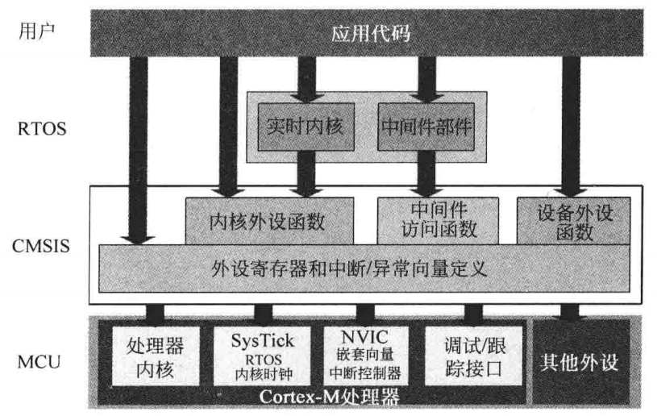
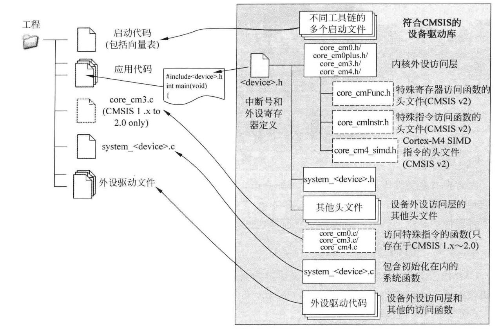
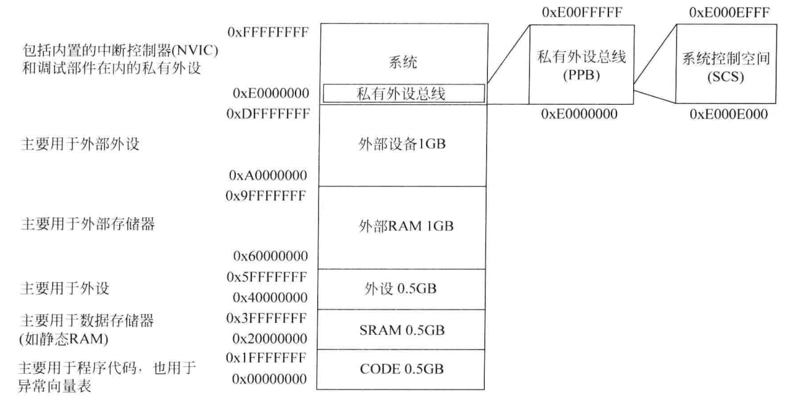
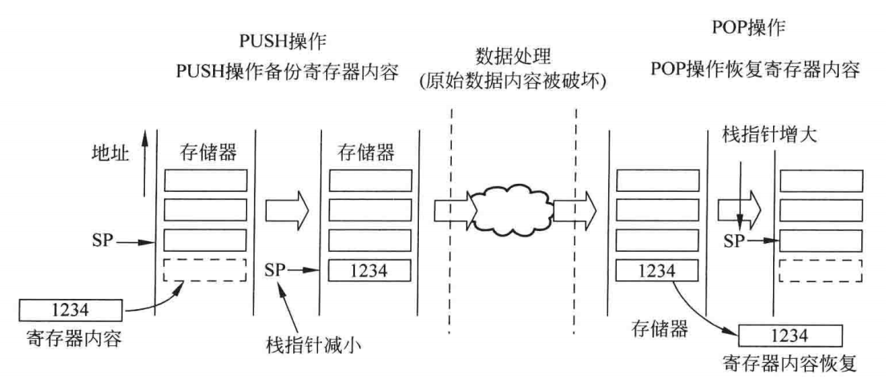

### SVC
> 系统服务调用，又称系统调用，用于产生系统函数的调用请求；
> 
> 当用户程序想要控制特定的硬件时，就要产生一个SVC异常，然后执行操作系统提供的SVC异常服务例程，再调用相关的操作系统函数，后者完成用户程序请求的服务。
> 
> 优点是可以将用户程序和系统硬件操作分离开，使用户程序无需关心硬件执行的细节，专注于软件的实现，也避免直接操作硬件导致系统的瘫痪，同时也使测试变得更加简单。

### PendSV
>与SVC不同的是，PendSV是可悬起的系统调用，

### CMSIS
> Cortex 微控制器软件接口标准，由ARM同多家微控制器供应商，工具供应商和软件解决方案提供商一道开发了CMSIS，一个涵盖了大多数Cortex-M处理器和Cortex-M微控制器产品的软件架构。

#### CMSIS项目

|    名称    |                             描述                             |
| :--------: | :----------------------------------------------------------: |
| CMSIS-Core |             可以访问Cortex-M处理器特性的一组API              |
| CMSIS-DSP  |              支持FFT和滤波器等多种常见的DSP运算              |
| CMSIS-SVD  | CMSIS系统视图描述，基于XML语言格式，用于描述微控制器的外设集 |
| CMSIS-RTOS |                        嵌入式OS的API                         |
| CMSIS-DAP  |          调试访问端口，支持USB到JTAG/串行协议的转换          |

#### CMSIS的标准化

|            方向            | 描述 |
| :------------------------: | :--: |
|     处理器外设的标准化     |      |
| 访问处理器特性的标准化函数 |      |
|  操作特殊指令的标准化函数  |      |
|    系统异常处理的标准化    |      |
|    系统初始化的标准函数    |      |
|  时钟频率变量名称的标准化  |      |

#### CMSIS的组织架构

- 内核外设访问层：内核外设寄存器的名称、地址定义以及访问内核寄存器和内核外设的辅助函数。

- 设备外设访问层：外设寄存器的名称、地址定义以及包括中断分配、异常向量定义等的系统设计。

- 外设访问函数：访问外设的驱动代码

  
  
  #### CMSIS-Core的文件组织
  
  

## 第四章  Cortex架构
> `Cortex-M3`和`Cortex-M4`处理器都基于`ARMv7-M`架构
### 编程模型
#### 操作模式和状态

操作状态：分为调试状态和Thumb状态，虽然存在ARM指令，但是不存在ARM状态。

操作模式：处理模式和线程模式,其中线程模式可以分为特权访问等级和非特权访问等级，由特殊寄存器CONTROL控制，从非特权等级切换到特权等级需要异常，几乎所有NVIC寄存器都只支持特权访问。

#### 寄存器

R0\~R12为通用目的寄存器，其中R0\~R7被称为低寄存器，许多16位指令只能访问低寄存器。
##### R13：栈指针(SP)
>物理上存在两个栈指针：主栈指针(MSP,或SP_main)，进程栈指针(PSP,或SP_process)，MSP和PSP的最低两位总为0。PSP的初始值未定义，而MSP的初始值则需要在复位流程中从存储器的第一个字中取出。
##### R14：链接寄存器(LR)
>用于函数或子程序调用时返回地址的保存
##### R15：程序计数器(PC)
>可读可写，读返回当前指令地址加4，写触发跳转操作。
##### xPSR：程序状态寄存器
- 应用PSR(APSR)
- 执行PSR(EPSR)
- 中断PSR(IPSR)，只读
##### CONTROL寄存器
- 位0(nPRIV)：为0时处于线程模式的特权等级、为1时处于线程模式的非特权等级

- 位1(SPSEL)：为0时线程模式使用MSP、为1时线程模式使用PSP，处于处理模式时，该位始终为0，并无法写。
  复位后，CONTROL寄存器默认为0，同时也只能在特权访问等级进行修改操作；
  `nPRIV`和`SPSEL`的不同组合：

  | nPRIV | SPSEL |        说明         |
  | :---: | :---: | :-----------------: |
  |   0   |   0   | MSP、特权等级、无OS |
  |   0   |   1   |  PSP、特权线程模式  |
  |   1   |   1   | PSP、非特权线程模式 |
  |   1   |   0   | MSP、非特权线程模式 |

### 存储器系统
- 4GB线性地址
- 存储器映射为多个区域
- 支持大小端模式
- 位段访问：可以实现对地址空间中单独位的原子操作
- 写缓冲
- 存储器保护单元(MPU)
- 非对齐传输支持

#### 存储器映射

#### 栈存储
栈可用于：
- 临时存储数据的初始值
- 往函数或子程序中的信息传递
- 用于存储局部变量
- 在中断等异常产生时保存处理器状态和寄存器数值
栈模型：
	满递减、栈顶为低地址、栈底在高地址

## OS支持特性
- 影子栈指针：MSP和PSP
- SysTick定时器：使得同一个嵌入式OS可以运行在多种Cortex-M微控制器中。
- SVC和PendSV异常
- 非特权执行等级
- 排他访问

其他：
- 程序代码使用Flash存储器、数据使用SRAM
- 实际的存储器接口细节对软件开发人员时不可见的。

## 

