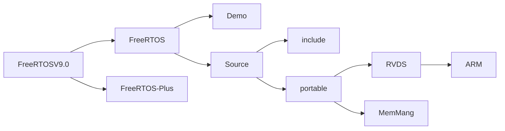
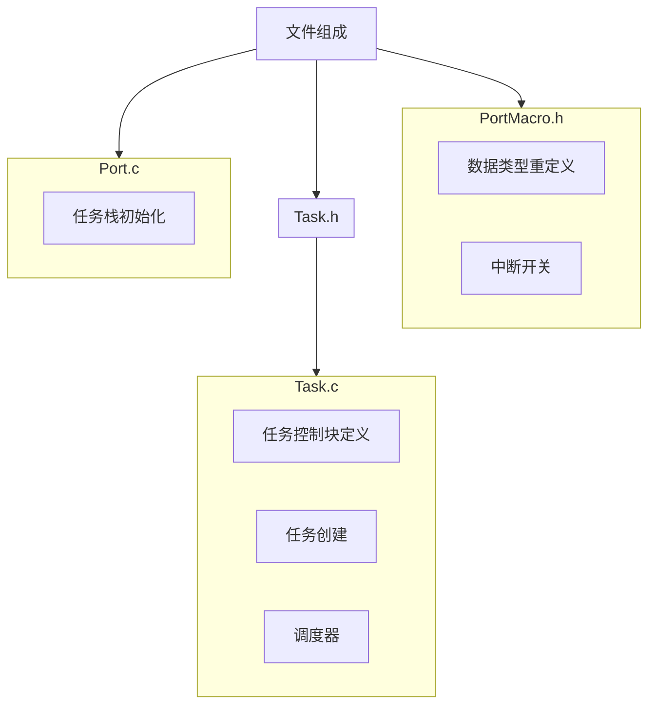
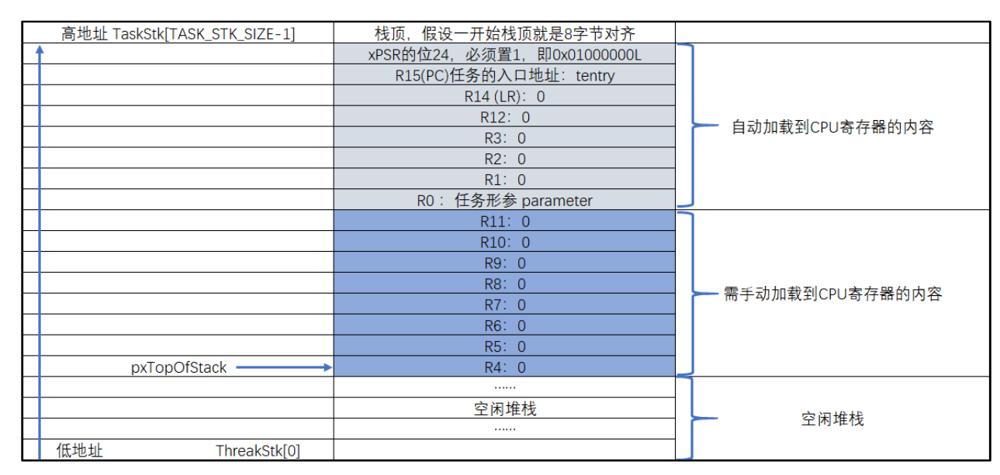
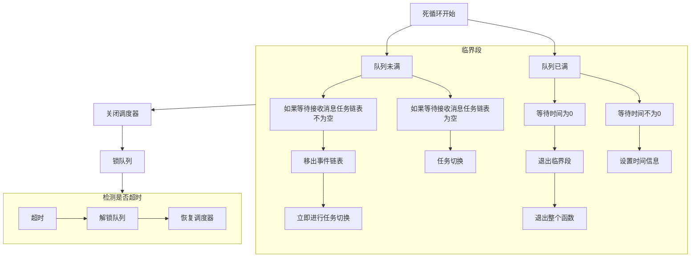
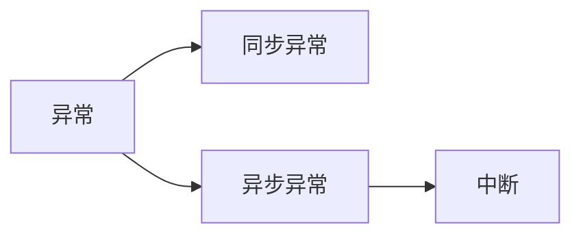

> 《FreeRTOS内核实现与应用开发实战指南》-野火

### 1.编程风格：

- 数据类型：

```c
/*头文件：portmacro.h*/
/*
	字：四字节
*/

/*数据类型重定义*/
#define portCHAR          char     /*单字节*/
#define portFLOAT         float    /*四字节*/
#define portDouble        double   /*八字节*/
#define portLONG          long     /*八字节*/
#define portSHORT         short    /*双字节*/
#define portSTACK_TYPE    uint32_t 
#define portBASE_TYPE     long

typedef portSTACKK_TYPE StackType_t;
typedef long BaseType_t;
typedef unsigned long UBaseType_t;

#if(configUSE_16_BIT_TICKS = 1)
typedef uint16_t TickType_t;
#define portMAX_DELAY (TickType_t)0xffff
#else
typedef uint32_t TickType_t;
#define portMAX_DELAY (TickType_t)0xffffffffUL
#endif
```

- 变量名：

  |                  数据类型                   | 前缀缩写 |
  | :-----------------------------------------: | :------: |
  |                    char                     |    c     |
  |                    short                    |    s     |
  |                    long                     |    l     |
  |                  unsigned                   |    u     |
  |                    指针                     |    p     |
  | 数据结构、任务句柄、队列句柄、portBASE_TYPE |    x     |

- 函数名：

  > 函数名 = 前缀缩写+文件名+函数功能

  |        函数类型        | 前缀缩写 |
  | :--------------------: | :------: |
  |      文件私有函数      |   prv    |
  |       返回值为空       |    v     |
  | 返回类型为复杂数据类型 |    x     |

- 宏：

  > freeRTOS中宏的前缀用于指示该宏位于哪个文件夹

  | 宏前缀 |         举例         |     所在文件     |
  | :----: | :------------------: | :--------------: |
  |  port  |    portMAX_DELAY     |    portable.h    |
  |  task  |  taskENTER_CRITICAL  |      task.h      |
  |   pd   |        pdTRUE        |    projdefs.h    |
  | config | configUSE_PREEMPTION | FreeRTOSConfig.h |
  |  err   |    errQUEUE_FULL     |    projdefs.h    |


### 2.FreeRTOS的目录结构


- `Demo`文件夹中包含`FreeRTOS`官方为各个单片机移植好的工程代码
- `include`和`Source`文件夹中分别包含`FreeRTOS`的头文件和源文件
- `RVDS`中包含很多与编译器和架构相关的可移植文件,主要是`port.c`和`portmacro`
- `MemMang`文件包含不同动态内存分配算法实现的文件
- `FreeRTOS-Plus`中包含第三方产品

### 3.FreeRTOS的文件组成




### 4. 新建FreeRTOS工程

#### 4.1 软件仿真

#### 4.2 实操

### 5.FreeRTOS的数据结构定义

#### 5.1链表

##### 5.1.1节点

```c
struct xList_ITEM
{
	TickType_t xItemValue;                /*升序排列的辅助值*/
	struct xLIST_TEAM * pxNext;           /*下一个节点*/
	struct xLIST_TEAM * pxPrevious;       /*上一个节点*/
	void* pvOwner;                        /*拥有该节点的内核对象，一般是任务控制块*/
	void* pvContainer;                    /*该节点所在的链表*/
};
typedef struct xLIST_ITEM ListItem_t;
```

#####  5.1.2根节点

```c
	typedef struct xLIST
	{
		UbaseType_t uxNumberOfItems; /*链表节点计数器*/
		ListItem_t *pxIndex;         /*链表节点索引指针*/
		MiniListItem_t xListEnd;     /*链表最后一个节点*/
	}List_t;
```

#### 5.2TCB

**TCB（Task Control Block 任务控制块）**

```c
/*ConfigMAX_TASK_NAME_LEN = 16*/
typedef struct tskTaskControlBlock
{
    volatile StackType_t  *pxTopOfStack;                         
    ListItem_t            xStateListItem;                       
    ListItem_t			xEventListItem;						 
	UBaseType_t			uxPriority;							 
    StackType_t           *pxStack;                              
    char                  PcTaskName[ConfigMAX_TASK_NAME_LEN]    
}tskTCB;
/*
 * Task control block.  A task control block (TCB) is allocated for each task,
 * and stores task state information, including a pointer to the task's context
 * (the task's run time environment, including register values)
 */
typedef struct tskTaskControlBlock
{
    /*栈 顶*/
	volatile StackType_t	*pxTopOfStack;	/*< Points to the location of the last item placed on the tasks stack.  THIS MUST BE THE FIRST MEMBER OF THE TCB STRUCT. */

	#if ( portUSING_MPU_WRAPPERS == 1 )
		xMPU_SETTINGS	xMPUSettings;		/*< The MPU settings are defined as part of the port layer.  THIS MUST BE THE SECOND MEMBER OF THE TCB STRUCT. */
	#endif
	
     /*任务节点,反向链接到任务轮询链表中*/ 
	ListItem_t			xStateListItem;	/*< The list that the state list item of a task is reference from denotes the state of that task (Ready, Blocked, Suspended ). */
	 /*事件节点*/
    ListItem_t			xEventListItem;		/*< Used to reference a task from an event list. */
    /* 任务优先级，越大优先级越高 */
	UBaseType_t			uxPriority;			/*< The priority of the task.  0 is the lowest priority. */
    /*任务栈起始地址*/
	StackType_t			*pxStack;			/*< Points to the start of the stack. */
	/*任务名称*/
    char				pcTaskName[ configMAX_TASK_NAME_LEN ];/*< Descriptive name given to the task when created.  Facilitates debugging only. */ /*lint !e971 Unqualified char types are allowed for strings and single characters only. */

	#if ( portSTACK_GROWTH > 0 )
		StackType_t		*pxEndOfStack;		/*< Points to the end of the stack on architectures where the stack grows up from low memory. */
	#endif

	#if ( portCRITICAL_NESTING_IN_TCB == 1 )
		UBaseType_t		uxCriticalNesting;	/*< Holds the critical section nesting depth for ports that do not maintain their own count in the port layer. */
	#endif

	#if ( configUSE_TRACE_FACILITY == 1 )
		UBaseType_t		uxTCBNumber;		/*< Stores a number that increments each time a TCB is created.  It allows debuggers to determine when a task has been deleted and then recreated. */
		UBaseType_t		uxTaskNumber;		/*< Stores a number specifically for use by third party trace code. */
	#endif

	#if ( configUSE_MUTEXES == 1 )
		UBaseType_t		uxBasePriority;		/*< The priority last assigned to the task - used by the priority inheritance mechanism. */
		UBaseType_t		uxMutexesHeld;
	#endif

	#if ( configUSE_APPLICATION_TASK_TAG == 1 )
		TaskHookFunction_t pxTaskTag;
	#endif

	#if( configNUM_THREAD_LOCAL_STORAGE_POINTERS > 0 )
		void *pvThreadLocalStoragePointers[ configNUM_THREAD_LOCAL_STORAGE_POINTERS ];
	#endif

	#if( configGENERATE_RUN_TIME_STATS == 1 )
		uint32_t		ulRunTimeCounter;	/*< Stores the amount of time the task has spent in the Running state. */
	#endif

	#if ( configUSE_NEWLIB_REENTRANT == 1 )
		/* Allocate a Newlib reent structure that is specific to this task.
		Note Newlib support has been included by popular demand, but is not
		used by the FreeRTOS maintainers themselves.  FreeRTOS is not
		responsible for resulting newlib operation.  User must be familiar with
		newlib and must provide system-wide implementations of the necessary
		stubs. Be warned that (at the time of writing) the current newlib design
		implements a system-wide malloc() that must be provided with locks. */
		struct	_reent xNewLib_reent;
	#endif

	#if( configUSE_TASK_NOTIFICATIONS == 1 )/*任务通知*/
		volatile uint32_t ulNotifiedValue;/*通知值*/
		volatile uint8_t ucNotifyState;/*通知状态*/
	#endif

	/* See the comments above the definition of
	tskSTATIC_AND_DYNAMIC_ALLOCATION_POSSIBLE. */
	#if( tskSTATIC_AND_DYNAMIC_ALLOCATION_POSSIBLE != 0 )
		uint8_t	ucStaticallyAllocated; 		/*< Set to pdTRUE if the task is a statically allocated to ensure no attempt is made to free the memory. */
	#endif

	#if( INCLUDE_xTaskAbortDelay == 1 )
		uint8_t ucDelayAborted;
	#endif

} tskTCB;

/* The old tskTCB name is maintained above then typedefed to the new TCB_t name
below to enable the use of older kernel aware debuggers. */
typedef tskTCB TCB_t;
```

#### 5.3队列

```c
typedef struct QueueDefinition
{
	int8_t *pcHead;/*指向第一个Item的第一个字节*/				
	int8_t *pcTail;	/*指向最后一个Item的最后一个字节*/			
	int8_t *pcWriteTo;/*指向消息存储区下一个可用消息空间*/				

	union							
	{
		int8_t *pcReadFrom;/*指向出队消息空间的最后一个*/			
		UBaseType_t uxRecursiveCallCount;/*记录递归互斥量被调用的次数*/
	} u;

	List_t xTasksWaitingToSend;	/*队列中等待发送消息的任务链表*/	
	List_t xTasksWaitingToReceive;	/*队列中等待接收消息的任务链表*/

	volatile UBaseType_t uxMessagesWaiting; /*队列可用消息个数*/
	UBaseType_t uxLength;			/*Item的个数*/
	UBaseType_t uxItemSize;			/*单个Item的大小 */

	volatile int8_t cRxLock;	/*队列锁*/	
	volatile int8_t cTxLock;		

	#if( ( configSUPPORT_STATIC_ALLOCATION == 1 ) && ( configSUPPORT_DYNAMIC_ALLOCATION == 1 ) )
		uint8_t ucStaticallyAllocated;	
	#endif

	#if ( configUSE_QUEUE_SETS == 1 )
		struct QueueDefinition *pxQueueSetContainer;
	#endif

	#if ( configUSE_TRACE_FACILITY == 1 )
		UBaseType_t uxQueueNumber;
		uint8_t ucQueueType;
	#endif

} xQUEUE;


typedef xQUEUE Queue_t;

```

#### 5.4信号量

> 信号使用的结构体和队列使用的结构体是同一类型，只是其中成员含义不同

```c
typedef struct QueueDefinition
{
	int8_t *pcHead;/*指向第一个Item的第一个字节*/				
	int8_t *pcTail;	/*指向最有一个Item的最后一个字节*/			
	int8_t *pcWriteTo;				

	union							
	{
		int8_t *pcReadFrom;			
		UBaseType_t uxRecursiveCallCount;
	} u;

	List_t xTasksWaitingToSend;	/*队列中等待发送消息的任务链表*/	
	List_t xTasksWaitingToReceive;	/*队列中等待接收消息的任务链表*/
	
    /*
    	表示有效信号量的个数
    	1.如果信号量是二值信号量，互斥信号量，值为1时表示有可用信号量，否则为没有可用信号量。
    	2.如果是计数信号量，则表示可用信号量的个数。
    */
	volatile UBaseType_t uxMessagesWaiting; 
    /*
    	表示最大的信号量可用个数
    	1.如果是二值信号量，互斥信号量，则uxLength为1。
    	2.如果是计数信号量，则表示最大信号量个数。
    */
	UBaseType_t uxLength;		
    /*用不到，默认值为0*/
	UBaseType_t uxItemSize;			

	volatile int8_t cRxLock;	/*队列锁*/	
	volatile int8_t cTxLock;		

	#if( ( configSUPPORT_STATIC_ALLOCATION == 1 ) && ( configSUPPORT_DYNAMIC_ALLOCATION == 1 ) )
		uint8_t ucStaticallyAllocated;	
	#endif

	#if ( configUSE_QUEUE_SETS == 1 )
		struct QueueDefinition *pxQueueSetContainer;
	#endif

	#if ( configUSE_TRACE_FACILITY == 1 )
		UBaseType_t uxQueueNumber;
		uint8_t ucQueueType;
	#endif

} xQUEUE;


typedef xQUEUE Queue_t;
```

#### 5.5 互斥量

​	互斥量使用的结构体也是队列结构体，其中的`uxRecursiveCallCount`表示递归互斥量被调用的次数，而`uxMessagesWaiting`用来表示有效互斥量的个数。

​	此外，结构体成员`pcHead`被重声明为`uxQueueType`，而`pcTail`被重声明为`pxMutexHolder`，分别表示队列类型、拥有该互斥量的任务控制块。

#### 5.6事件组

```c
typedef struct xEventGroupDefinition
{
	EventBits_t uxEventBits;
	List_t xTasksWaitingForBits;		/*< List of tasks waiting for a bit to be set. */

	#if( configUSE_TRACE_FACILITY == 1 )
		UBaseType_t uxEventGroupNumber;
	#endif

	#if( ( configSUPPORT_STATIC_ALLOCATION == 1 ) && ( configSUPPORT_DYNAMIC_ALLOCATION == 1 ) )
		uint8_t ucStaticallyAllocated; /*< Set to pdTRUE if the event group is statically allocated to ensure no attempt is made to free the memory. */
	#endif
} EventGroup_t;
```

#### 5.7定时器

```c
typedef struct tmrTimerControl
{
	const char				*pcTimerName;			/*定时器名*/
	ListItem_t				xTimerListItem;			/*定时器节点，用于插入定时器列表*/
	TickType_t				xTimerPeriodInTicks;	/*定时器周期*/
	UBaseType_t				uxAutoReload;			/*单次(0)/周期(1)模式*/
	void 					*pvTimerID;				/*数字ID，用于在回调函数中区分不同定时器*/
	TimerCallbackFunction_t	pxCallbackFunction;		/*回调函数*/
	#if( configUSE_TRACE_FACILITY == 1 )
		UBaseType_t			uxTimerNumber;		
	#endif
	#if( ( configSUPPORT_STATIC_ALLOCATION == 1 ) && ( configSUPPORT_DYNAMIC_ALLOCATION == 1 ) )
		uint8_t 			ucStaticallyAllocated; 
	#endif
} xTIMER;
```

### 6.任务

**任务栈**

>每个任务都有一个独立的任务栈，栈是存在于RAM中的一段内存，最小为128个字，即512个字节。
>考虑到浮点运算的需要，栈顶需要向下做8字节对齐。
>
>当任务第一次运行时，将从`pxTopofStack`往上加载8个字的内容到CPU寄存器：R4、R5、R6、R7、R8、R9、R10、R11，当退出异常时，栈中剩下的8个字的内容会自动加载到CPU寄存器：R0、R1、R2、R3、R12、R14、R15、xPSR。此时PC指针将指向任务入口地址，从而跳转到第一个任务。

#### 空闲任务
	空闲任务是FreeRTOS系统中没有其他工作时自动进入的系统任务，因为处理器总是需要代码来执行，所以至少要有一个任务处于运行态，在调用`vTaskStartScheduler()`时，调度器会自动创建一个空闲任务，用户可以通过空闲任务钩子添加自己的功能函数。
	空闲任务的功能包括但不限于释放已经删除任务的内存。

#### 守护任务
	

#### 创建任务的两种方式：

- 静态创建 ：栈和TCB的内存事先分配好 
  ```C
  /**************************************************************
	Input:
		  pxTaskCode: 函数指针，typedef void(*TaskFunction_t)(void *)
			  pcName: 任务名称
		ulStackDepth: 任务栈大小，单位为字
		pvParameters: 任务形参
	  puxStackBuffer: 任务栈起始地址，不可改变其指针指向
		pxTaskBuffer: 任务控制块结构体指针
	Return：
		typedef void * TaskHandle_t;
	**************************************************************/
  TaskHandle_t xTaskCreateStatic(TaskFunction_t pxTaskCode,
  							 const char * const pcName,
								 const uint32_t ulStackDepth,
								 void * const pvParameters
								 StackType_t * const puxStackBuffer,
								 TCB_t * const pxTaskBuffer)
	{ 
	    prvInitialiseNewTask()
	    {
	        /*获取栈顶地址*/
	        /*向下做8字节对齐*/
	        /*将任务名字存储在TCB中*/
	        /*初始化TCB中的链表节点成员*/
	        /*初始化任务栈*/
	        pxPortInitialiseStack()
	        {
	             /*栈顶地址-1*/
	             /*xPSR的bit24置1*/
	             /*栈顶地址-1*/
	             /*任务函数的入口地址*/
	             /*栈顶地址-1*/
	             /*任务的返回地址*/
	             /*栈顶地址-5*/
	             /*任务形参*/
	             /*栈顶地址-8，即跳过需要手动加载到CPU寄存器的内容,此时的栈顶往下都是空闲的堆栈*/	
	        }
	        /*让任务句柄指向任务控制块*/
	    }
	    prvAddNewTaskToReadyList()/*加入就绪列表*/
	}
	```
- 动态创建：栈和TCB的内存动态分配
```C

```

#### 删除任务：
> `vTaskDelete()`函数：
> 删除任务的工作流程就是先将任务从就绪链表中移除，同时将其从事件链表移除。如果任务正在删除自己，就将其插入`xTaskWaitingTermination`链表中，同时将`uxDeletedTasksWaitingCleanUp`+1，以表示在切换任务后由空闲任务进行内存释放，并如果是一个任务正在删除另一个任务，则


### 7.调度器

就绪列表

> 任务就绪链表实际就是一个根节点的数组，数组的大小由`configMAX_PRIORITIES`决定，数组下标对应任务的优先级，同一优先级的任务统一插入到就绪列表的同一条列表中。

> 实现任务的切换：从就绪列表找到优先级最高的任务并执行。
```C
void vTaskStartScheduler(void)
{
	/*启动调度器*/
	xPortStartScheduler()
	{
		/*配置PendSV和SysTick的中断优先级为最低*/
		/*启动第一个任务*/
		prvStartFirstTask()
		{
			/*更新MSP的值*/
			/*产生SVC系统调用切换到第一个任务*/
			vPortSVCHandler()
			{
			}
		}
	}
}
```
#### 任务优先级：
任务的优先级以升序比较，数字越大的优先级越高，最低的优先级为0,0优先级一般为空闲任务使用；
FreeRTOS采用两种方法查找最高优先级的任务，第一种是就绪列表中按高优先级往低优先级查找就绪任务。第二种则是利用计算前导零指令`CLZ`，直接在`uxTopReadyPriority`这个32位的变量中直接得出当前优先级最高的就绪任务。

#### 任务状态：
- 挂起态：不参与调度，即不会得到CPU的使用权，通过`vTaskSuspend()`函数；
- 就绪态：
- 运行态：
- 堵塞态：挂起、延时、读信号量等待；

#### 特点：
- 相同优先级的任务采用时间片轮转方式进行调度；
- 任务调度的原则是一旦任务状态发生了改变，并且当前运行的任务优先级小于优先级队列组中任务最高优先级时，立刻进行任务切换；

### 8.临界段

使用场景：

- 系统调度
- 外部中断

类似于Linux系统中的原子操作，目的是为了一段需要连续执行的代码不会被打断，FreeRTOS中保护临界段的方式就是控制中断开关。

中断关函数分为带返回值和不带返回值两种，
	不带返回值的关中断函数不能嵌套，也不能在中断中使用
	带返回值的关中断函数既可以嵌套也可以在中断中使用，其返回值是更新前BASEPRI的值。

进入临界段和退出临界段函数分为两种：
	不带中断保护、不能嵌套：（非中断场合使用）
		`taskENTER_CRITICAL()` 进入临界段
		`taskEXIT_CRITICAL()` 退出临界段
	带中断保护，可嵌套：(中断服务函数内使用)
		`taskENTER_CRITICAL_FROM_ISR()` 进入临界段
		`taskEXIT_CRITICAL_FROM_ISR()`退出临界段

### 9.消息队列

[结构体定义：](#5.3队列)
消息队列是一种常用于任务间通信的数据结构，队列可以在任务与任务间、中断和任务间传递消息，实现了任务接收来自其他任务或中断的不固定长度的消息。
消息队列是一种异步的通信方式。

FreeRTOS中的消息队列具有以下特性:
- 消息支持先进先出方式排队，支持异步读写工作方式；
- 读写队列均支持超时机制；
- 消息支持后进先出方式排队，往队首发送消息；
- 可以允许不同长度(不超过队列节点最大值)的任意类型消息；
- 一个任务能够从任意一个消息队列接收和发送消息；
- 多个任务能够从同一个消息队列接收和发送消息；
- 当队列使用结束后，可以通过删除队列函数进行删除；

#### 运作机制：
- 初始化：
- 消息发送(写)：
  1. 如果是紧急消息，则可以直接插入队首；
  2. 当队列允许入队时，可以选择等待发送；
- 消息接收(读)：
  当任务读消息有三种选择：
  1. 不等待；
  2. 延时等待；
  3. 堵塞；
- 环形缓冲区：

 如果有多个任务堵塞在一个消息队列中，那么这些堵塞的任务将按照任务优先级进行排序，优先级高的任务将优先获得队列的访问权；

#### 消息发送：
1. 进入死循环；
2. 关中断，开启临界段；
3. 如果队列未空，复制数据到消息队列中；
4. 如果等待接收链表非空，则立即开始任务切换；
5. 如果等待接收链表为空，并且任务切换请求不为假则立即开始任务切换；
6. 如果不是则开中断，退出临界段；
7. 如果队列已经满员；
8. 如果等待时长为0，则退出临界段，然后直接退出；
9. 如果等待时长不为0.记录当前时间



#### 队列锁
如果等待时间并不为0，则队列会在期间进入堵塞状态，在这个过程中，不应该有其他任务和中断操作这个队列的`xTasksWaitingToReceive`列表和`xTaskWaitingToSend`列表，因为可能引起其他任务解除堵塞，这可能会发生优先级翻转；
比如任务A的优先级低于当前任务，但是在当前任务进入堵塞的过程中，任务A的优先级低于当前任务，但是在当前任务进入堵塞的过程中，任务A却因为其他原因解除堵塞了，这是明令禁止的。

队列的结构为头结点(队列描述结构体)+Item数组，其中Item的数据类型可以由用户自定义。

#### 使用注意事项：
- 使用`xQueueSend()`、`xQueueSendFromISR()`、`xQueueReceive()`等这些函数之前应先创建消息队列，并根据队列句柄进行操作；
- 队列读取采用的是先进先出(FIFO)模式，会先读取先存储在队列中的数据，同时，FreeRTOS也支持后进后出(LIFO)模式；
- 在获取队列中消息的时候，必须先定义一个存储读取数据的地方，并且该数据区域大小不小于消息大小，否则，很可能引起地址非法的错误；
- 无论是发送或者是接收消息都是以拷贝的方式进行，如果消息过于旁边，可以将消息的地址作为消息进行发送、接收；
- 队列是具有自己独立权限的内核对象，并不属于任何任务，所有任务都可以向同一个队列写入和读出，一个队列由多任务或中断写入是经常的事；

#### 其他
- `xQueueReceive()`与`xQueuePeek()`的区别：
`xQueueReceive()`会在接收到消息将消息删除，而`xQueuePeek()不会；


### 10.信号量
	信号量是一种实现任务间通信的机制，可以实现任务之间同步或临界资源的互斥访问，常用于协助相互竞争的任务来访问临界资源。在多任务系统中，各任务之间需要同步或互斥实现临界资源的保护，信号量功能可以为用户提供这方面的支持。

1. 创建二值信号量:`xSemaphoreCreateBinary()`。
2. 创建计数信号量:`xSemaphoreCreateCounting()`。

所有的信号量创建函数都是在内部调用同一个函数:`xQueueGenericCreate()`。

功能函数：

1. `xSemaphoreGive()`：实质是调用`xQueueGenericSend()`入队。
	用于二值信号量、计数信号量、互斥量的释放，不包括递归互斥量，此外该函数不能在中断中使用。
2. `xSemaphoreGiveFromISR()`：`xSemaphoreGive()`的中断版本。
	可以释放二值信号量和计数信号量，但是不能释放互斥量，这是因为互斥量不可以在中断中使用，互斥量的优先级继承机制只能在任务中起作用；
3. `xSemaphoreTake()`:实质是调用`xQueueGenericReceive()`出队。
	用于获取二值信号量、计数信号量和互斥量，不带中断保护。
4. `xSemaphoreTakeFromISR()`：`xSemaphoreTake()`的中断版本。
5. `vSemaphoreDelete()`：信号量删除函数

#### 10.1二值信号量
	二值信号量既可以用于临界资源访问也可以用于同步功能；
	例如任务1获取信号量而进入堵塞，任务2在条件达成后释放信号量，于是任务1获得信号量得以进入就绪态，如果任务1的优先级时最高的，那么就会立即切换任务，从而完成两个任务间的同步。

- `xSemaphoreCreateBinary()`
	​使用`xSemaphoreCreateBinary()`创建的二值信号量暂时是空的，需要先使用`xSemaphoreGive()`释放信号量。

应用场景：
	外部传感器在得到数据后就可以释放二值信号量，显示屏在得到二值信号量后刷新数据；

#### 10.2计数信号量
	计数信号量常用于事件计数和资源管理；
	在使用完资源的时候必须归还信号量，否则当计数值为0的时候任务就无法访问该资源了；

- `xSemaphoreCreateCounting()`

#### 10.3互斥信号量
	互斥信号量与二值信号量极为相似，只是互斥信号量多了优先级继承机制；

#### 10.4递归信号量
	递归信号量可以重复获取调用，对于已经获取递归互斥量的任务可以重复获取该递归互斥量，该任务将拥有递归信号量的所有权，任务成功获取几次递归互斥量就要返还几次，在此之前递归互斥量都处于无效状态，其他任务无法获取，只有持有递归信号量的任务才能获取和释放。

### 11.互斥量
	互斥量又称互斥信号量，是一种特殊的二值信号量，与信号量不同的是支持互斥量所有权，递归访问以及防止优先级翻转的特性，用于实现堆临界资源的独占式处理。
	任意时刻互斥量的状态只有两种：开锁或闭锁；
	当互斥量被任务持有时，该互斥量处于闭锁状态，这个任务获得互斥量的所有权；
	当该任务释放这个互斥量时，该互斥量处于开锁状态，这个任务失去互斥量的所有权；
	互斥量因为拥有优先级继承机制，所以更适合用于保护资源的互锁。

#### 11.1特性
- 递归访问：
	持有互斥量的任务能够再次获得这个锁而不被挂起。
- 优先级继承：
	暂时提高某个占有某种资源的低优先级任务的优先级，使之与在所有等待该资源的任务中优先级最高的任务的优先级相等。而当这个低优先级任务执行完毕释放该资源时，让优先级重新回到初始设定值。
- 优先级翻转：
	在抢占资源的时候，因为低优先级提前抢占了资源导致高优先级的任务也不得不进入堵塞状态，这种高优先级无法运行而低优先级任务可以运行的现象称为“优先级翻转”。
- 无法在中断中使用；

1. `xSemaphoreCreateMutex()`：创建互斥量
2. `xSemaphoreCreateRecursiveMutex()` ：创建递归互斥量
3. `vSemaphoreDelete()`：删除信号量
4. `xSemaphoreTake()`：获取互斥量函数
5. `xSemaphoreTakeRecursive()`: 递归互斥量获取函数，获取多少次就要释放多少次；
6. `xSemaphoreGive()`：互斥量释放函数
7. `xSemaphoreGiveRecursive()`:释放递归互斥量

#### 11.2互斥量

- 优先级翻转
- 优先级继承

#### 11.3递归互斥量

- 相比互斥量：

### 12.软件定时器

工作机制：
	存在两个链表： xActiveTimerList1和 xActiveTimerList2用于挂载生成的软件定时器，其中2是用于管理计时溢出的情况下的定时器任务。同时在系统初始化启动调度器的时候，会创建一个定时器守护任务，该任务的作用是轮询链表中的定时器任务是否到期，到期则调用相应的回调函数。
	在创建软件定时器的时候每个定时器都可以单独设置一个回调函数；
	FreeRTOS的软件定时器采用消息队列进行通信，利用“定时器命令队列”向软件定时器任务发送一些命令，任务在接收到命令就会去
	
	处理对应的程序，比如启动定时器，停止定时器等。
	如果使用软件定时器功能，在系统运行之初启动调度器的时候，系统会为之创建一个定时器任务(守护任务)，该任务会在运行时比较当前系统时间和下一个定时器到期的时间，如果到期就会进行处理，如果有回调函数就会调用其钩子函数。

工作模式：
- 单次模式：
- 周期模式：

配置需求：
- `configUSE_TIMERS  1`
- `configSUPPORT_DYNAMIC_ALLOCATION 1`
- `timer.c`

软件定时器注意事项：
- 软件定时器的回调函数中应快进快出，绝对不允许使用任何可能引起软件定时器任务挂起或者堵塞的API接口，在回调函数中也绝对不允许出现死循环；
- 软件定时器使用了系统的一个队列和一个任务资源，软件定时器任务的优先级默认为`configTimer_TASK_PRIORTY`,建议将软件定时器的优先级设为最高级；
- 创建单次软件定时器，该定时器超时执行完回调函数后，系统会自动删除该软件定时器，并回收资源；
- 定时器任务的堆栈大小为：`configTIMER_TASK_STACK_DEPTH`个字节。

相关API：

1. `xTimerCreate()`：动态创建软件定时器；
2. `xTimerCreateStatic()`：静态创建软件定时器；
3. `xTimerStart()`：开启定时器；
4. `xTimerStartFromISR()`：从中断中开启定时器；
5. `xTimerStop()`：关闭定时器；
6. `xTimerStopFromISR()`：从中断中关闭定时器；
7. `xTimerGenericCommand()`：定时器的通用命令控制函数；
8. `xTimerDelete()`：定时器删除函数；

### 13.任务通知

支持版本：V8.2.0以后，任务自带；

只允许在任务中等待通知，而不允许在中断中等待通知；

优点：开销小，响应快，任务创建了就可以直接用，且无需包含其他文件(tasks.c)
缺点：只能有一个任务接收通知消息，只有等待通知的任务可以被堵塞，发送通知的任务不会被堵塞。

配置需求：
- `configUSE_TASK_NOTIFICATIONS 1`

任务通知的几种方式：
- 发送通知给任务，如果有通知未读，不覆盖通知值；
- 发送通知给任务，直接覆盖通知值；
- 发送通知给任务，设置通知值的一个或者多个位，可以当做事件组来使用；
- 发送通知给任务，递增通知值，可以当做计数信号量使用；

相关API：
 发送任务通知：
1. `xTaskGenericNotify()`：发送任务通知函数;
2. `xTaskGenericNotifyFromISR()`：发送任务通知函数的中断保护版本;
3. `xTaskNotifyGive()`：递增任务通知值；
4. `vTaskNotifyGiveFromISR`：递增任务通知值的中断保护版本；
5. `xTaskNotify()`：向指定任务发送一个任务通知；
6. `xTaskNotifyFromISR()`：任务通知的中断保护版本；
7. `xTaskNotifyAndQuery()`：任务通知并返回对象任务上一次的通知值；
8. `xTaskNotifyAndQueryFromISR()`：中断保护版本；
 获取任务通知：
1. `ulTaskNotifyTake()`：用于获取一个任务通知，获取二值信号量，计数信号量类型的任务通知；
2. `xTaskNotifyWait()`：用于等待一个任务通知，并带有超时等待；

个人理解：
  等待通知，如果设置了延时时间，则加入延时链表，然后切换任务，如果在这延时
期间内有任务通知到该任务则将其从延时链表中移除，并将其状态设置为等待消息，如
果被唤醒的任务大于当前发送通知的任务则将进行任务切换。

### 14.内存管理
>可靠性要求高的应该选择静态内存分配，一般的则可以选择动态内存分配；

内存管理方案：
>对于`heap1.c、heap2.c、heap4.c`这三种内存管理方案，内存堆实际上是一个很大的数组，定义为`static uint8_t ucHeap[configTOTAL_HEAP_SIZE]`，其中`configTOTAL_HEAP_SIZE`表示系统管理内存的大小。
>对于`heap3.c`方案，它封装了c标准库中的`malloc()`和`free()`函数。
>`heap5.c`方案允许用户使用多个非连续内存堆空间，每个内存堆的起始地址核大小由用户定义，使用外部内存的比较适合这种方案。

#### heap1.c
特点：
- 只可分配内存，无法释放内存；
- 执行时间是确定的并且不会产生内存碎片；
具体实现：
```c
static size_t xNextFreeByte = (size_t) 0;/*剩余自由内存的大小，单位：字节*/

static uint8_t *pucAlignedHeap  = NULL；/*指向对齐后的内存堆起始地址*/
```

#### heap2.c
特点：
- 最佳匹配算法，寻找最小内存块；
- 无法解决内存碎片的问题；
- 效率比`malloc()`函数高；
具体实现：
`heap2.c`采用链表结构记录空闲内存块，将所有的空闲内存块组成一个空闲内存块表。
```c
typedef struct A_BLOCK_LINK{
	struct A_BLOCK_LINK *pxNextFreeBlock;/*指向下一个节点*/
	size_t xBlockSize;/*记录申请的内存块大小，包括链表结构体大小*/
}BlockLink_t;
```
在申请内存的时候，系统会先从内存块空闲链表开始去遍历（该链表按内存块大小排序），返回最佳匹配的空闲内存块，如果对该内存块进行分割后还有剩余就会在剩余内存中建立新的内存节点并将其按大小顺序插入链表中。
在释放内存的时候会将释放的内存重新插入链表中，但是无法将相邻的内存块进行合并。

#### heap3.c
特点：
- 需要链接器设置一个堆，`malloc()`和`free()`函数由编译器提供；
- 具有不确定性；
- 很可能增大RTOS内核的代码大小；
- `FreeRTOSConfig.h`文件中的`configTOTAL_HEAP_SIZE`宏定义将不起作用；
具体实现：
 在启动文件中设置堆的大小；

#### heap4.c
特点：
- 内存节点插入链表的方式为内存地址的升序；
- 在释放内存的时候可以将相邻两块空闲内存合并；
- 可用于重复删除任务、队列、信号量、互斥量等的应用程序；
- 可用于分配和释放随机字节内存的应用程序，但并不像`heap2.c`那样产生严重的内存碎片；
- 具有不确定性，但是效率比标准C库的`malloc()`函数要高；

#### heap5.c
特点：
  采用最佳匹配算法和合并算法，并且允许内存堆跨越多个非连续的内存区，也就是允许在不连续的内存堆中实现内存分配。即允许使用多个存储芯片；
使用：
  在使用`heap_5.c`内存管理方案创建任何对象前，要先调用`vPortDefineHeapRegions()`函数将内存初始化；
```c
typedef struct HeapRegion{
   uint8_t *pucStartAddress; /*用于内存堆的内存块起始地址*/
   size_t xSizeInBytes;/*内存块大小*/
}HeapRegion_t;
```
  同时，用户需要指定每个内存堆区域的起始地址和内存堆大小、将他们放在一个HeapRegion_t结构体类型数组中，这个数组必须用一个NULL指针和0作为结尾，起始地址必须按从小到大排列。
```c
/*在内存中为内存堆分配两个内存块*/
/*第一个内存块大小为0x10000字节，起始地址为0x80000000*/
/*第二个内存块大小为0xa0000字节，起始地址为0x90000000*/
/*起始地址为0x80000000的内存块地址更低，所以放到数组第一个位置*/
const HeapRegion_t xHeapRegions[] = {
   {(uint8_t * ) 0x80000000UL,0x10000},
   {(uint8_t * ) 0x90000000UL,0xa0000},
   {NULL,0}
};
```
### 15.中断管理
异常：任何打断处理器正常执行，并且迫使处理器进入一个由有特权的特殊指令执行的
事件。

同步异常：MCU内部异常

异步异常：MCU外围设备，中断属于异步异常；



FreeRTOS的中断管理支持：

- 开/关中断；
- 恢复中断；
- 中断使能；
- 中断屏蔽；
- 可选择系统管理的中断优先级；

中断响应流程：外设-->中断控制器(NVIC)-->CPU;

中断处理流程：硬件中断发生后，CPU到中断处理器读取中断向量，查找到中断向量表
中的对应位置，进入中断服务函数；

中断分类：
- 咬尾中断：
- 晚到中断（嵌套中断）；

中断相关名词：
- 中断号：中断请求信号的ID；
- 中断请求；
- 中断优先级；
- 中断处理程序；
- 中断触发；
- 中断触发类型；
- 中断向量：中断服务程序的入口地址；
- 中断向量表：存储中断向量的存储区，中断向量与中断号对应，中断向量在中断向量表中按照向量号顺序存储；

中断延迟：硬件中断发生到开始执行中断处理程序第一条指令之间的时间。
### 16.事件
	事件是一种实现任务间通信的机制，主要用于多任务之间的同步，但事件通信只能是事件类型的通信，无数据的传输。
	与信号量不同的是，事件可以实现一对多，多对多的同步，即一个任务可以等待多个事件的发生：可以是任意一个事件发生时唤醒任务进行事件处理，也可以是几个事件都发生后才唤醒任务进行事件处理，同样，也可以是多个任务同步多个事件。
	事件组存储在一个`EventBits_t`类型的变量中，如果宏`configUSE_16_BIT_TICKS`被定义为1，那么`EventBits_t`就是16位的，其中8个位用于存储事件组。如果是该宏定义为0则`EventBits`就是32位的，其中有24个位用来存储事件组。
	`EventBits`中每一位可以代表一个事件，任务通过“逻辑与”或“逻辑或”与一个或多个事件建立关联，形成一个事件组。
	事件的“逻辑或”也被称作是独立型同步，指的是任务感兴趣的所有事件任一件发生即可被唤醒；
	事件的“逻辑与”则被称作为关联型同步，指的是任务感兴趣的若干事件都发生时才被唤醒，并且事件发生的时间可以不同步；
	任务可以通过设置事件位来实现事件的触发和等待操作，FreeRTOS的事件仅用于同步，不提供数据传输功能；
	除了事件标志组变量之外，FreeRTOS还使用了一个链表来记录等待事件的任务，所有在等待此事件的任务均会被挂载在等待事件列表：`xTasksWaitingForBits`。

FreeRTOS提供的事件具有如下特点：
- 事件只与任务相关联，事件相互独立；
- 事件仅用于同步，不提供数据传输功能；
- 事件无排队性，即多次向任务设置同一事件，等效于只设置一次；
- 允许多个任务对同一事件进行读写操作；
- 支持事件等待超时机制；

#### 使用：
- 在`FreeRTOSConfig.h`定义宏`configSUPPORT_DYNAMIC_ALLOCATION`为1;
- 将`FreeRTOS/source/event_groups.c`添加到工程中；

#### 相关API：
- `xEventGroupCreate()`：事件创建函数；
- `xEventGroupCreateStatic()`:事件创建函数；
- `vEventGroupDelete()`：事件删除函数；
- `xEventGroupSetBits()`：事件组置位函数，设置的位是或上给事件组变量的。
- `xEventGroupSetBitsFromISR()`：事件组置位函数；
	该函数并不直接操作事件组变量，而是给守护任务发送一个消息，让置位事件组的操作在守护任务里面完成，守护任务是基于调度所而非临界段的机制来实现的。
- `xEventGroupWaitBits()`：等待事件函数；
- 

### 17.协程

### 18.CPU利用率统计
 想要使用CPU利用率统计的话需要有以下准备：
 ```C
 #define configGENERATE_RUN_TIME_STATS 1 /*启用运行时间统计功能*/
#define configUSE_TRACE_FACILITY 1 /*启用可视化跟踪调试*/

/* 与宏 configUSE_TRACE_FACILITY 同时为 1 时会编译下面 3 个函数*/
/* prvWriteNameToBuffer()*/
/* vTaskList(),*/
/* vTaskGetRunTimeStats()*/

#define configUSE_STATS_FORMATTING_FUNCTIONS 1

extern vloatile uint32_t CPU_RunTime;/*用于统计定时器中断的次数*/

#define portCONFIGURE_TIMER_FOR_RUN_TIME_STATS() （CPU_RunTime = 0ul）
#define portGET_RUN_TIME_COUNTER_VALUE() CPU_RunTime

 ```

用于统计系统运行时间的定时器中断服务函数：
```c
/* 用于统计运行时间 */
volatile uint32_t CPU_RunTime = 0UL;
void BASIC_TIM_IRQHandler (void)
{
	if ( TIM_GetITStatus( BASIC_TIM, TIM_IT_Update) != RESET ) {
		CPU_RunTime++;
		TIM_ClearITPendingBit(BASIC_TIM , TIM_FLAG_Update);
	 }
  }
```

相关API:
- `vTaskGetRunTimeStats()`：用于获取任务信息，包括任务名称，任务状态信息，任务优先级，剩余堆栈以及任务编号的信息；
- `vTaskGetRunTimeStats()`：用于统计各个任务占用CPU时间的函数；

### FreeRTOS的启动

1.

> main函数中将硬件初始化，再将RTOS系统初始化，一次性启动所有任务

2.

> ​	main函数中将硬件和RTOS系统先初始化，创建启动任务后就启动调度器，然后在启动代码中创建各种应用任务。


### 其他：
- `prvStartFirstTask()`
> `prvStartFirstTask()`函数用于开始第一个任务，主要工作包括更新MSP的值以及产生SVC调用，到SVC中断服务函数里面切换到第一个任务；
> ```c
> __asm void prvStartFirstTask(void)
> {
> 	PRESERVE8     # 8字节对齐
> 	
>     ldr r0, =0xE000ED08 # SCB_VTOR的地址
>     ldr r0, [r0]
>     ldr r0, [r0]
>     
>     msr msp, r0  # 设置MSP的值
>     
>     # 使能全局中断
>     cpsie i
>     cpsie f
>     dsb
>     isb
>     
>     # 调用SVC去启动第一个任务
>     svc 0
>     nop
>     nop
> }
> ```
- `vPortSVCHandler()`
>```c
>__asm void vPortSVCHandler(void)
>{
>	extern pxCurrentTCB; 
>	PRESERVE8
>	ldr r3,=pxCurrentTCB /*加载pxCurrentTCB的地址到r3*/
>	ldr r1,[r3] /*加载pxCurrentTCB的值到r3*/
>	ldr r0,[r1]/*加载pxCurrentTCB指向的任务控制块到r0*/
>	ldmia r0!,[r4-r11]
>	msr psp,r0
>	isb
>	mov r0 # r0
>	msr basepri,r0 /*打开全部中断*/
>	orr r14,# 0xd /*使用PSP完成出栈操作并返回后进入任务模式，返回Thumb状态*/
>	bxx r14
>	
>}
>```
- `taskYIELD()`
>```c
>#define taskYIELD  portYIELD()
>#define portNVIC_INT_CTRL_REG  (*(( volatile uint32_t *) 0xe000ed04))
>#define portNVIC_PENDSVSET_BIT ( 1UL << 28UL )
>#define portSY_FULL_READ_WRITE ( 15 )
>#define portYIELD()
>{
>   /*触发PendSV，产生上下文切换*/
>   portNVIC_INT_CTRL_REG = portNVIC_PENDSVSET_BIT;
>   __dsb( portSY_FULL_READ_WRITE );
>   __isb( portSY_FULL_READ_WRITE );
>}
>
- `xPortPendSVHandler()`
>```c
> __asm void xPortPendSVHandler(void)
> {
> 	extern pxCurrentTCB;
> 	extern vTaskSwitchContext;
> 	PRESERVE8
> 	mrs r0 PSP /*将PSP的值存储到r0*/
> 	isb
> 	
> 	ldr r3,=pxCurrentTCB
> 	ldr r2,[r3] /*r2等于pxCurrentTCB*/
> 	
> 	stmdb r0!,{r4-r11}/*将寄存器r4~r11的内容压入当前堆栈，同时更新r0的值，先递减再操作*/
> 	str r0,[r2]/*将r0的值存储到上一个任务的栈顶指针，至此完成上文保存*/
> 	
> 	stmdb sp!,{r3,r14}/*将r3,r14压入当前堆栈，准备进入，此时是MSP*/
> 	mov r0,#configMAX_SYSCALL_INTERRUPT_PRIORITY 
> 	msr basepri,r0/*优先级低于11的中断被屏蔽，进入临界段*/
> 	dsb
> 	isb
> 	
> 	bl vTaskSwitchContext /*转到该函数，该函数的作用是选择最高优先级的任务*/
> 	
> 	mov r0,# 0
> 	msr basepri ,r0      /*关临界段*/
> 	
> 	ldmia sp!,{r3,r14}/*R3此时指向了下一个将要运行的任务的TCB*/
> 	/*加载新任务的堆栈*/
> 	ldr r1,[r3]
> 	ldr r0,[r1]
> 	ldmia r0!,{r4-r11}
> 	
> 	msr psp,r0/*更新PSP的值*/
> 	isb
> 	bx r14 /*返回，切换到新的任务*/
> 	nop
> }
>```
>
- 向下八字节对齐
> `prvInitialiseNewTask`函数中有一个对任务栈大小进行八字节对齐的技巧；
> `实际的栈顶地址 = 用户输入的栈顶地址 & (~(0x0007))`
- SVC中断函数名需与向量表中注册的名称一致吗？
> 在Cortex-M中，`0xE000ED08`是`SCB_VTOR`寄存器的地址，`SCB_VTOR`寄存器存放的是`MSP`的地址，`MSP`的默认值为`0x00000000`
- RTOS中的阻塞延时
>在RTOS中，当任务需要延时的时候，任务会放弃CPU的使用权，转而执行其他任务，当任务延时时间到了就会继续执行任务
- 空闲任务
>RTOS会为CPU创建一个空闲任务，一般是做一些系统内存的清理工作。

- 系统上电第一个执行的是复位函数`Reset_Handler`,


### 附录
#### Cortex-M汇编指令

| 指令名 |   用法    |          描述           |
| :----: | :-------: | :---------------------: |
|  CPS   |           |      快速开关中断       |
|        | `CPSID I` |  关中断，即`PRIMASK=1`  |
|        | `CPSIE I` |  开中断，即`PRIMASK=0`  |
|        | `CPSID F` | 关异常，即`FAULTMASK=1` |
|        | `CPSIE F` | 开异常，即`FAULTMASK=0` |

#### Cortex-M内核寄存器

|   名字    |                           功能描述                           |
| :-------: | :----------------------------------------------------------: |
|  PRIMASK  | bit位，置1时可以关掉所有可屏蔽的异常，只剩下NMI和硬FAULT可以响应，缺省值为0 |
| FAULTMASK | bit位，置1时只有NMI可以响应，所有异常、甚至FAULT都无法响应，缺省值为0 |
|  BASEPRI  | 最多9位，优先级号大于其值的中断都将被屏蔽，缺省值为0，不关闭任何中断 |

#### 特权模式和线程模式
- 特权模式：异常服务例程；
- 线程模式：普通应用程序；

#### 特权级别
- 特权级：可以自由访问硬件资源；
- 用户级：
用户级进入特权级的唯一办法就是通过异常；

#### 参考资料
[关于 - 《FreeRTOS中文文档 V0.0.1》 - 书栈网 · BookStack](https://www.bookstack.cn/read/freeRTOS_Document/readme.md)
《FreeRTOS内核及应用开发实战》-野火

### 相关API
- `vTaskSuspendAll()`
> 调用多少次`vTaskSuspendAll()`就要调用多少次`xTaskResumeAll()`；
- `vTaskDelete()`函数
>如果是删除自身，则形参为`NULL`;