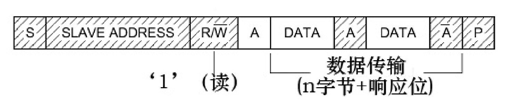
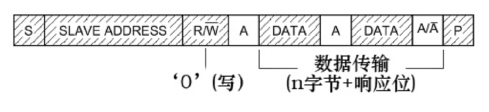
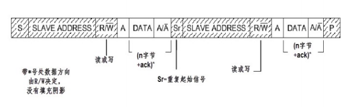

### IIC
	IIC通讯协议（Inter-Intergrated CirCuit）是由Phiilps公司开发的，由于引脚少，硬件实现简单，可扩展性强，不需要USART、CAN等通讯协议的外部收发设备，现在被广泛地使用在系统多个集成电路（IC）间的通讯；

#### 物理层：
- 支持多个设备，支持多个通讯主机及多个通讯从机；
- 一个I2C总线只使用两条总线线路，一条双向串行数据线（SDA），一条串行时钟线（SCL），数据线即用来表示数据，时钟线用于数据收发同步；
- 每个连接到总线的设备都有一个独立的地址，主机可以利用这个地址进行不同设备之间的访问；
- 总线通过上拉电阻接到电源，当I2C设备空闲时会输出高阻态，当所有设备都空闲，当输阻高阻态时，由上拉电阻把总线拉成高电平；
- 多个主机同时使用总线时，为了防止数据冲突，会利用仲裁方式决定由哪个设备占用总线；
- 具有三种传输模式：标准模式（100kb/s）、快速模式（400kb/s）、高速模式（3.4mb/s）；
- 连接到相同总线的IC数量受到总线的最大电容400Pf限制；

#### 协议层
	IIC的协议定义了通讯的起始和停止信号，数据有效性，响应、仲裁、时钟同步和地址广播等环节；

- 读：

- 写：

- 复合通讯

其中：
- 阴影区域值数据从主机传输到从机，空白区域指数据从从机传输至主机；
- S表示起始信号
- R/W-表示传输方向选择位，1为读，0为写；
- A/A-表示应答和非应答信号；高电平表示非应答信号，低电平表示应答信号； 
- P：停止传输信号；

##### 协议内容：
起始信号产生后，连接到总线上的所有从机都会接收到这个信号，所有从机开始等待主机接下来广播的从机地址信号，在I2C总线上，每个设备的地址都是唯一的，当主机广播的地址与某个设备地址相同时，这个设备就被选中了，没被选中的设备将会忽略之后的数据信号；从机地址可以是7位或10位；
在地址位之后，是传输方向的选择位，该位为0时，表示后面的数据传输方向是由主机传输至从机，即主机向从机写数据，该位为1时则是主机从从机读数据；
从机接收到匹配的地址后，主机或从机会返回一个应答或非应答信号，只有接收到应答信号后，主机才能继续发送或接收数据；
- 写数据：
	如果配置的方向传输位为写方向时，主机在接收到应答信号后，主机就开始正式向从机传输数据，数据包的大小为8位，主机每发送完一个字节数据都要等待从机的应答信号，主机可以无限重复这个过程直到主机发送一个停止传输信号，表示不再传输数据；

- 读数据：
	如果配置的方向传输位为读方向时，主机广播完地址接收到应答信号后，从机开始向主机传输数据，数据包的大小也为8位，从机每发送完一个数据，都会等待主机的应答信号，从机可以无限重复这个过程，当主机希望停止接收数据时，就会向从机返回一个非应答信号，则从机自动停止数据传输；

- 复合通讯：
	IIC通讯更常用的是复合格式，该传输过程有两次起始信号（S），一般在第一次传输中，主机通过Slave_Address寻找到从设备后，发送一段用于表示从设备的寄存器地址，再在第二次的传输中对该地址的内容进行读或写。

- 通讯的起始和停止信号
	起始信号：SCL线是高电平时SDA线从高电平向低电平切换；
	停止信号：SCL线是高电平时SDA线从低电平向高电平切换；

- 数据有效性：
	IIC使用SDA信号线来传输数据，使用SCL信号线进行数据同步，SDA数据线在SCL的每个时钟周期传输一位数据，传输时，SCL为高电平的时候SDA表示的数据有效，即此时的SDA为高电平时表示数据“1”，为低电平时表示数据“0”。为SCL为低电平时，SDA的数据无效，一般在这时候SDA进行电平切换，为下一次表示数据做好准备；

- 地址及数据方向：
	I2C总线上的每个设备都有自己的独立地址，主机发起通讯时，通过SDA信号线发送设备地址来查找从机，I2C协议规定设备地址可以是7位或10位，实际中7位的地址应用比较广泛，紧跟设备地址的一个数据位用来表示数据传输方向。 

参考资料：
- [IIC的仲裁机制](https://blog.csdn.net/qq_29350001/article/details/78835639)
- 