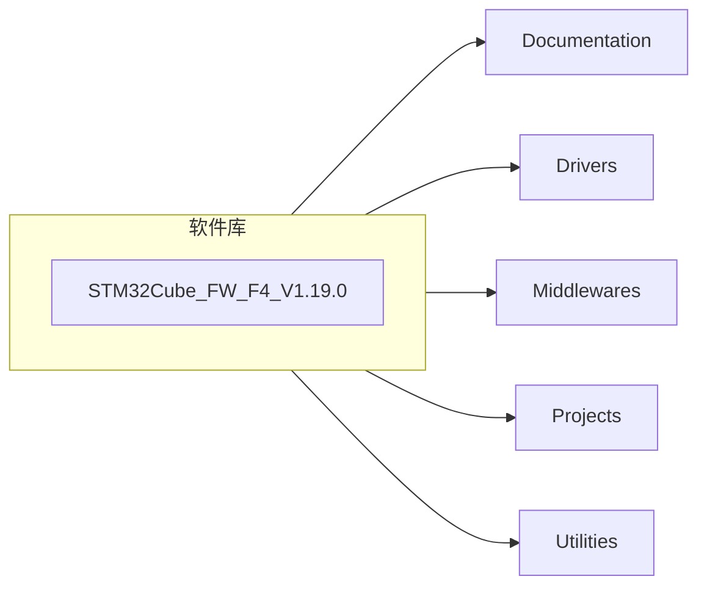
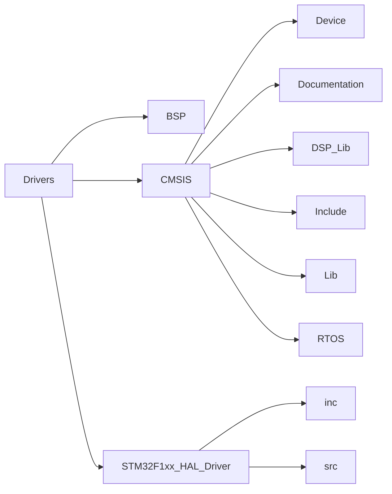
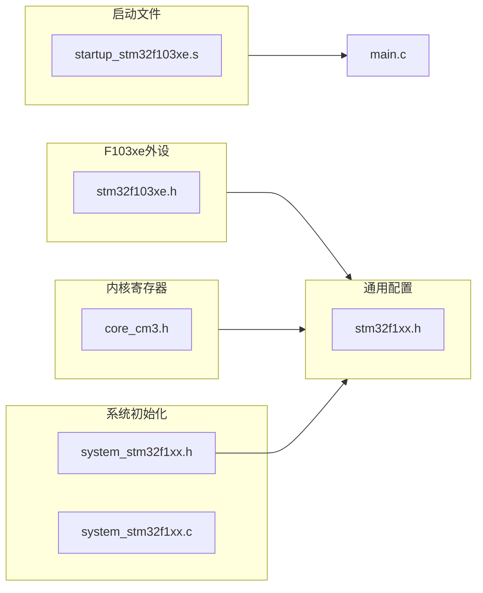
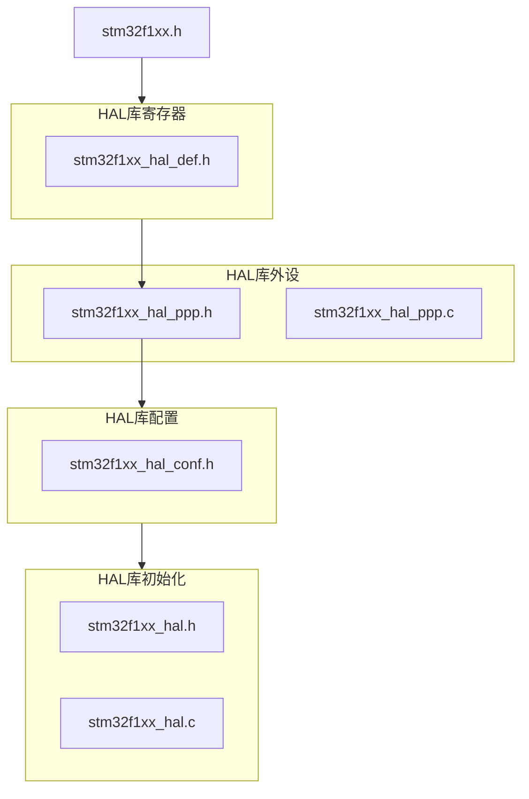

## HAL库及CMSIS

### 1.CMSIS标准及库层次关系

> 因为基于Cortex系列芯片采用的内核都是相同的，区别主要为核外的片上外设的差异，这些差异导致软件在同内核不同外设的芯片上移植困难，为了解决不同芯片厂商生产的Cortex微控制器软件的兼容性问题，ARM与芯片厂商建立了CMSIS标准(Cortex MicroController Software Interface Standard)。

CMSIS核心层包括：
- 内核函数层：包括用于访问内核寄存器的名称、地址定义，主要由ARM公司定义；
- 设备外设访问层：提供片上核外外设的地址核中断定义，主要由芯片生产商提供；

HAL库的内容包括：

其中：
- `Documentation`:帮助文档
- `Drivers`:HAL库及CMSIS组件。
- `Middlewares`:中间件，包括ST官方的STemWin、STM32_Audio、STM32_USB_Device_Library等
- `Projects`:为官方开发板的例子
- `Utilities`:实用的公用组件

Driver文件夹中包括

Driver
- BSP：官方开发套件的Demo
- CMSIS
	- Device：跟具体芯片有关、包含启动 文件、芯片外设寄存器定义、系统时钟初始化
	- Documentation
	- DSP_Lib：数字信号处理库
	- Include：包含CMSIS标准的核内设备函数层的Cortex-M核通用的头文件
	- Lib：适配不同编译器的数学函数库
	- RTOS：
- STM32F1xx_HAL_Driver
	- inc：各个片上外设的驱动头文件
	- src：各个片上外设的驱动源文件

项目配置文件：

### 2.工程配置文件

启动文件：`\Drivers\CMSIS\Device\ST\STM32F1xx\Source\Templates\arm`：
- startup_stm32f103xe.s
ARM提供：`/Drivers/CMSIS/include`
- core_cm3.h
- core_cmFunc.h
- core_cmInstr.h
- cmsiss_armcc.h

厂商提供：`/Driver/CMSIS/Device/ST/STM32F1xx`
 `Include`:
- stm32f1xx.h
- stm32f103xe.h
- system_stm32f1xx.h
`Source/Template`:
- system_stm32f1xx.c
HAL库：`\Drivers\STM32F1xx_HAL_Driver`

### 3.文件配置关系
CMSIS：

HAL：

如上，stm32f1xx被包含进stm32f1xx_hal_def.h头文件中，再被各个外设的Hal库驱动文件包含，这样各个外设驱动文件内的函数就可以获取到各个外设的寄存器。
而通过stm32f1xx_hal_conf.h就可以自由选择包含哪些外设文件。
