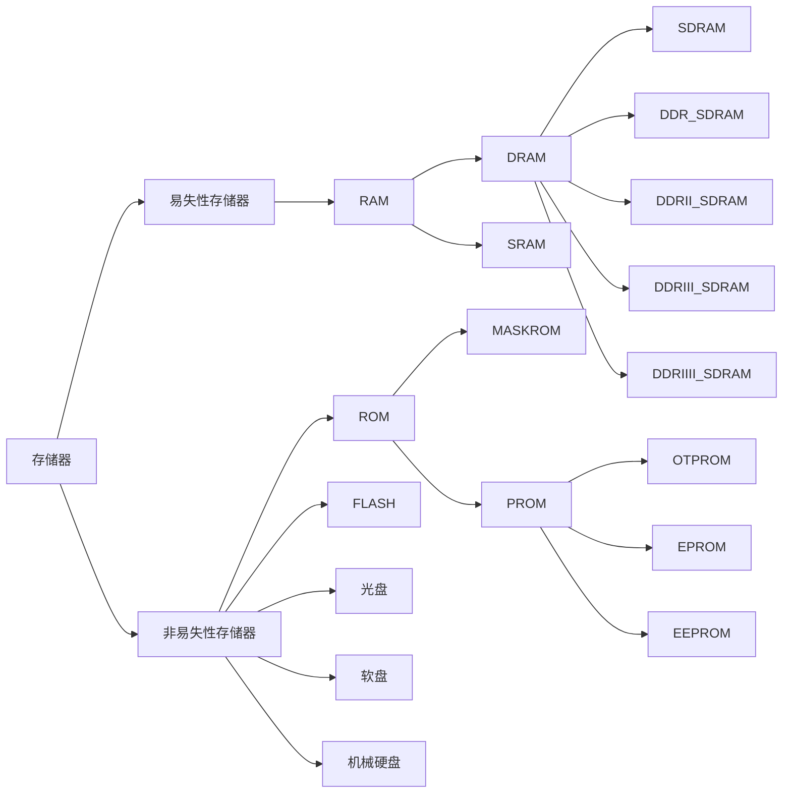

## 存储器

### 常见存储器简介

#### 易失性存储器 RAM
静态随机存储器：Static Random Access Memory,以锁存器存储数据,异步方式读取；
动态随机存储器：Dynamic Random Access Memory,以电容的电荷存储数据，同步方式读取；

SRAM和DRAM对比
|     特性     | SRAM | DRAM |
| :----------: | :--: | :--: |
|   存取速度   | 较快 | 较慢 |
|    集成度    | 较低 | 较高 |
|   生产成本   | 较高 | 较低 |
| 是否需要刷新 |  否  |  是  |

#### 非易失性存储器ROM
- MASKROM：内部数据内容出厂时固化，不可修改
- OTPROM：One Time Programmable 内部数据用户可写入一次，之后不可修改
- EPROM：Erasable Programmable 可重复擦写，但是需要使用专门的紫外线照射设备擦除
- EEPROM：Electrically Erasable Programmable 可重复擦写，电擦除，使用方便

##### 非易失性存储器FLASH
- NorFlash：内部存储块按或非方式连接
- NandFlash：内部存储块按与非方式连接
比较：
|       特性       |    NOR FLASH     |   NAND FLASH    |
| :--------------: | :--------------: | :-------------: |
| 同容量存储器成本 |       较贵       |     较便宜      |
|      集成度      |       较低       |      较高       |
|     介质类型     |     随机存储     |    连续存储     |
|  地址线和数据线  |     独立分开     |      共用       |
|     擦除单元     | 以“扇区/块”擦除  | 以“扇区/块”擦除 |
|     读写单元     | 可以基于字节读写 |  必须以块读写   |
|     读取速度     |       较高       |      较低       |
|     写入速度     |       较低       |      较高       |
|       坏块       |       较少       |      较多       |
|   是否支持XIP    |       支持       |     不支持      |
使用场景：
- NorFlash：一般是代码存储的场合，比如控制器内部的程序存储空间。
- NandFlash：一般是大数据量存储的场合，如SD卡、U盘以及固态硬盘。

### 存储器映射
32位MCU的寻址地址为0x0~0xFFFFFFFF,ARM将其分为8个块，并规定了每个块的用途

|  序号  |       用途        |         地址范围          |
| :----: | :---------------: | :-----------------------: |
| Block0 |       Code        | 0x0000 0000 ~ 0x1FFF FFFF |
| Block1 |       SRAM        | 0x2000 0000 ~ 0x3FFF FFFF |
| Block2 |     片上外设      | 0x4000 0000 ~ 0x5FFF FFFF |
| Block3 | FSMC的Bank1~Bank2 | 0x6000 0000 ~ 0x7FFF FFFF |
| Block4 | FSMC的Bank3~Bank4 | 0x8000 0000 ~ 0x9FFF FFFF |
| Block5 |    FSMC寄存器     | 0xA000 0000 ~ 0xCFFF FFFF |
| Block6 |     没有使用      | 0xC000 0000 ~ 0xDFFF FFFF |
| Block7 | Coretx-M3内部外设 | 0xE000 0000 ~ 0xFFFF FFFF |

#### Block0

Block0一般用于内部Flash，Block0 的内部划分如下：

|         地址范围          |                             用途                             |
| :-----------------------: | :----------------------------------------------------------: |
| 0x0000 0000~0x00077 FFFF  |       取决于Boot引脚，为Flash、系统存储器、SRAM的别名        |
| 0x0008 0000 ~ 0x07FF FFFF |                             预留                             |
| 0x0800 0000 ~ 0x0807 FFFF |                           用户代码                           |
| 0x0808 0000 ~ 0x1FFF EFFF |                             预留                             |
| 0x1FFF F000 ~ 0x1FFF F7FF |                    系统存储器：Bootloader                    |
| 0x1FFF F800 ~ 0x1FFF F80F | 选项字节：用于配置读写保护，BOR级别，软件/硬件看门狗及器件处于待机或停止模式下的复位，当芯片被锁住后，可以从RAM里面启动来修改此部分对应的寄存器。 |
| 0x1FFE C008 ~ 0x1FFF FFFF |                             预留                             |

片内Flash的大小一般为256KB或512KB。

#### Block1

其内部区域功能划分为：

|         地址范围          | 用途说明  |
| :-----------------------: | :-------: |
| 0x2000 0000 ~ 0x2000 FFFF | SRAM 64KB |
| 0x2001 0000 ~ 0x3FFF FFFF |   预留    |

片内SRAM的大小一般为48KB或64KB。

#### Block2

Block2用于设计片内外设，根据总线速度不同，Block2的区域功能划分为：

|         地址范围          |   用途说明   |
| :-----------------------: | :----------: |
| 0x4000 0000 ~ 0x4000 77FF | APB1总线外设 |
| 0x4001 0000 ~ 0x4001 3FFF | APB2总线外设 |
| 0x4001 8000 ~ 0x5003 FFFF | AHB总线外设  |

#### 位段（位带操作）

FatFs文件系统