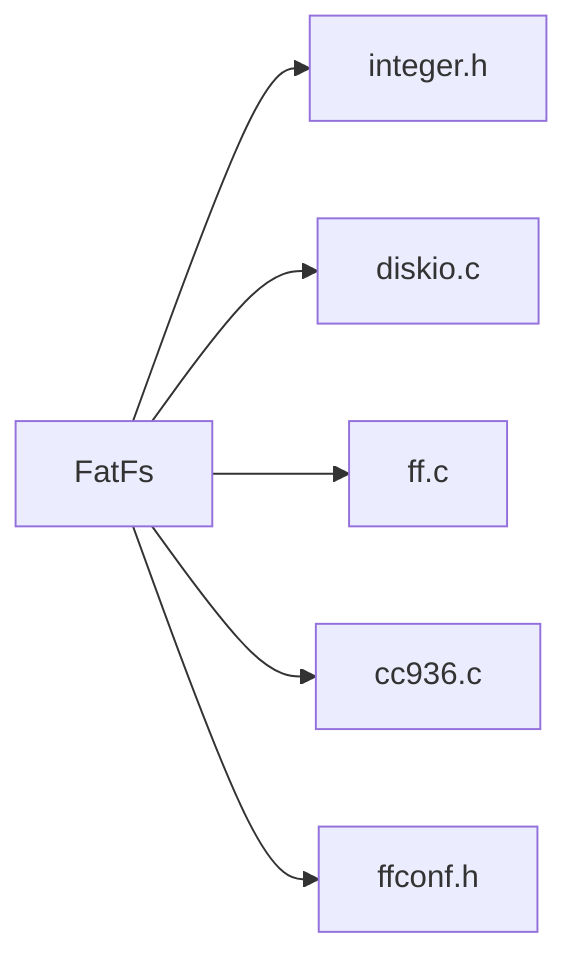
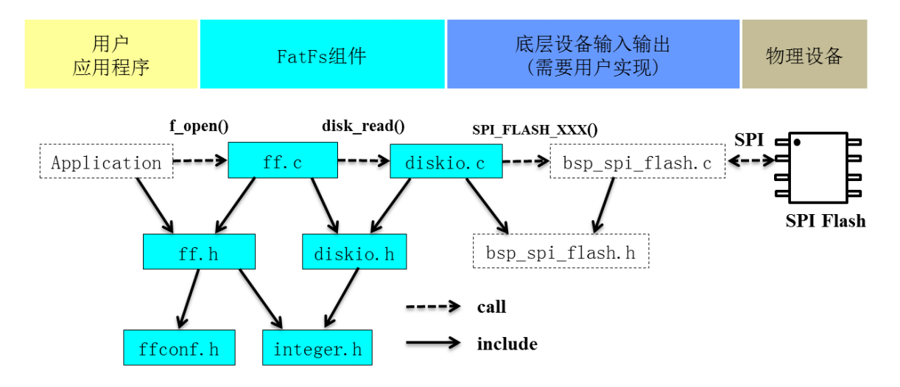
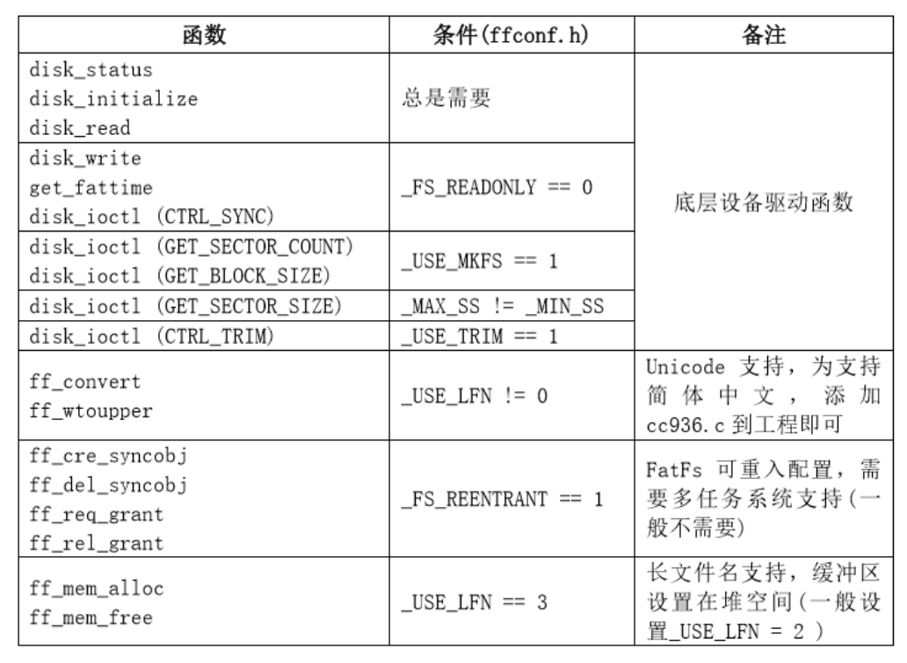

[FatFs 官网，用于查看API详情](http://elm-chan.org/fsw/ff/00index_e.html)
参考内容：
[FatFs文件系统 - 孤情剑客 - 博客园 (cnblogs.com)](https://www.cnblogs.com/The-explosion/p/13170732.html)

文件系统：为了存储和管理数据，而在存储介质建立起的一种组织架构，包括系统引导区、目录和文件。
Windows下常见的文件系统格式包括FAT32、NTFS、exFAT。

##### FatFs文件系统简介

FatFs是面向小型嵌入式系统的一种通用的FAT文件系统，完全由ANSI C语言编写并且完全独立于底层的IO介质，因此可以很容易地移植到其他处理器中。
源文件包括：


其中：

- `integer.h`:文件中包括了一些数值类型定义；
- `diskio.c`:包括底层存储介质地操作函数，需用户自己实现 ，主要添加底层驱动函数。
- `ff.c`:FatFs核心文件，文件管理地实现方法。该文件独立于底层介质操作文件的函数，利用这些函数实现文件的读写。
- `cc936.c`:本文件在option目录下，是简体中文支持所需要添加的文件，包括了简体中文的GBK和Unicode相互转换功能函数。
- `ffconf.h`:包含对FatFs功能配置的宏定义，通过修改这些宏定义就可以裁剪FatFs的功能。

FatFs文件系统使用的结构图为：



##### FatFs使用：
如果需要使用FatFs文件系统中的某些函数，需要在`ffconf.h`文件中对相应的宏进行修改

此外，需要自定义`diskio.c`中的函数内容，如果要支持中文需要添加`cc936.c`并修改对应宏（`CODE_PAGE`)
使用步骤为：
1.挂载文件系统(f_mount)，如果没有，就先格式化文件系统，再挂载；


##### FAT32文件格式：

##### FatFs源码解析：
1.结构体：
FatFs源码中存有四个结构体声明,如果不关注FAT32文件系统的实现，就可以只看后面三个结构体：
- 文件系统FATFS；
- 文件对象FIL；
```c
/* File object structure (FIL) ，类比Linux系统中的文件句柄*/
typedef struct {
    FATFS*  fs;                    /*指向关联的文件系统对象*/
    WORD    id;                /*拥有该文件的文件系统的注册ID(f_mount)*/
    BYTE    flag;                /* 状态标志 */
    BYTE    err;                   /* 中止标志 */
    DWORD   fptr;           /* 文件读写指向 */
    DWORD   fsize;          /* 文件大小 */
    DWORD   sclust;         /* File start cluster (0:no cluster chain, always 0 when fsize is 0) */
    DWORD   clust;          /* Current cluster of fpter (not valid when fprt is 0) */
    DWORD   dsect;          /* Sector number appearing in buf[] (0:invalid) */
#if !_FS_READONLY
    DWORD   dir_sect;       /* Sector number containing the directory entry */
    BYTE*   dir_ptr;        /* Pointer to the directory entry in the win[] */
#endif
#if _USE_FASTSEEK
    DWORD*  cltbl;          /* Pointer to the cluster link map table (Nulled on file open) */
#endif

#if _FS_LOCK
    UINT    lockid;         /* File lock ID origin from 1 (index of file semaphore table Files[]) */
#endif
#if !_FS_TINY
    BYTE    buf[_MAX_SS];   /* File private data read/write window */
#endif
} FIL;
```
- 目录对象DIR；
```c
/* Directory object structure (DIR) */
typedef struct {
    FATFS*  fs;             /* Pointer to the owner file system object (**do not change order**) */
    WORD    id;             /* Owner file system mount ID (**do not change order**) */
    WORD    index;          /* Current read/write index number */
    DWORD   sclust;         /* Table start cluster (0:Root dir) */
    DWORD   clust;          /* Current cluster */
    DWORD   sect;           /* Current sector */
    BYTE*   dir;            /* Pointer to the current SFN entry in the win[] */
    BYTE*   fn;             /* Pointer to the SFN (in/out) {file[8],ext[3],status[1]} */
#if _FS_LOCK
    UINT    lockid;         /* File lock ID (index of file semaphore table Files[]) */
#endif
#if _USE_LFN
    WCHAR*  lfn;            /* Pointer to the LFN working buffer */
    WORD    lfn_idx;        /* Last matched LFN index number (0xFFFF:No LFN) */
#endif
#if _USE_FIND
    const TCHAR*    pat;    /* Pointer to the name matching pattern */
#endif
} DIR;
```
- 文件信息FILINFO；
```c
/* File information structure (FILINFO) */
typedef struct {
    DWORD   fsize;          /* File size */
    WORD    fdate;          /* Last modified date */
    WORD    ftime;          /* Last modified time */
    BYTE    fattrib;        /* 文件属性，如：AM_DIR*/
    TCHAR   fname[13];      /* Short file name (8.3 format) */
#if _USE_LFN
    TCHAR*  lfname;         /* 长文件名 */
    UINT    lfsize;         /* Size of LFN buffer in TCHAR */
#endif
} FILINFO;
```