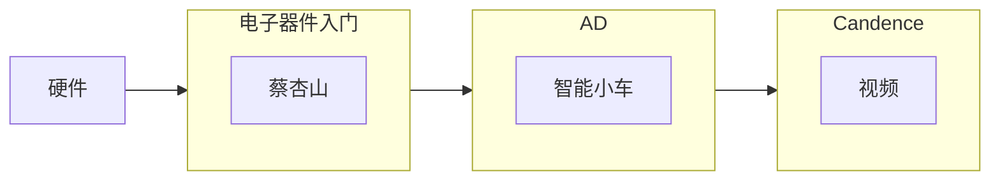
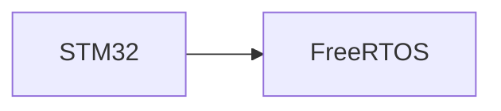
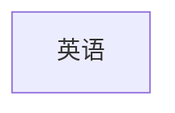

### 工作日
上午：

下午：

晚上:

### 周末
1. 电路原理
2. word、PPT、Visio
3. PS
4. obsidian
5. shell
6. makefile
7. linux系统编程
8. source insight 使用
9. 博文
10. Beyond Compare

### 硬件
各个电子器件的具体应用，比如光电耦合器的应用
前期先软件为主，硬件为辅，等学完RTOS多侧重一下硬件，晚上看看英语，然后看看公众号上的文章，多看看资料。
周末多学一些其他的，比如shell、makefile、Linux系统编程、多进程、多线程、线性代数、机器人学，视觉

### 计划：
硬件学习顺序：蔡杏山-入门篇，智能小车元器件的数据手册、野火开发板的原理图、看完视频，制作自己的智能小车，复习模电、电路，LtSpice，开始学习Candence；
软件学习顺序：尽量两天一章或三天一章的速度学完HAL库，边学权威指南，边学RTOS。做个小项目、学习电机控制及工业运动控制；
持续学习英语；
最后冲刺：C语言复习、Shell、Makefile、linux体系、Linux系统编程。

