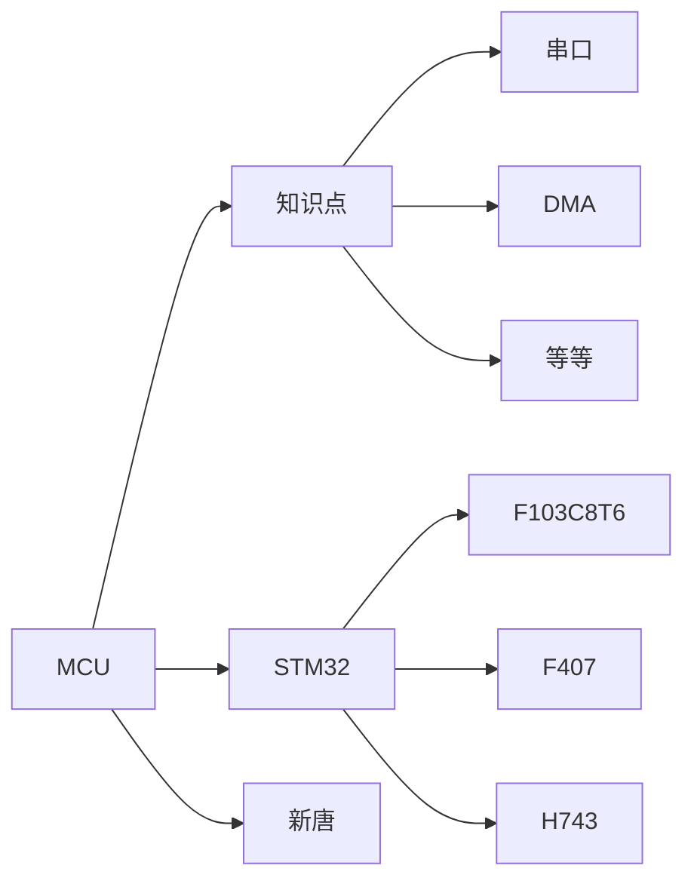

MCU里面的文件组织可以改为

```mermaid
	flowchart LR
	MCU-->知识点-->串口
	知识点-->DMA
	知识点-->等等
	MCU-->STM32-->F103C8T6
	STM32-->F407
	STM32-->H743
	MCU-->新唐
```
基础知识
HAL库
参考手册
数据手册

等待通知，如果设置了延时时间，则加入延时链表，然后切换任务，如果在这延时期间内有任务通知到该任务则将其从延时链表中移除，并将其状态设置为等待消息，如果被唤醒的任务大于当前发送通知的任务则将进行任务切换。