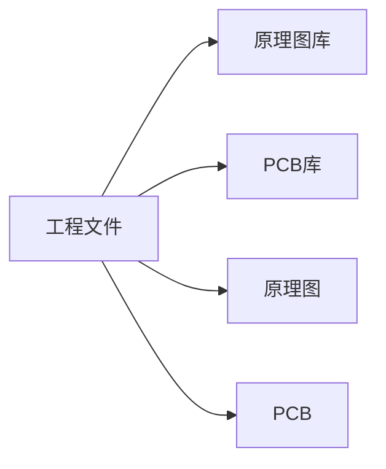

视频地址 [AD20-智能小车](https://www.bilibili.com/video/BV16t411N7RD?p=4&share_source=copy_pc)

**项目创建：**

```mermaid
flowchart LR
	工程文件-->原理图库
	工程文件-->PCB库
	工程文件-->原理图
	工程文件-->PCB
```

### 14 封装的统一管理
- 工具-->封装管理器
> 列出元件列表，进行封装
> 2:49位置

