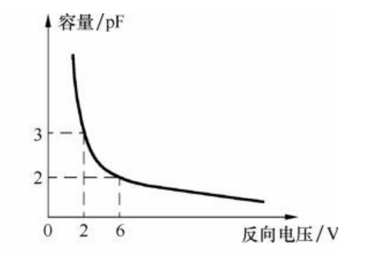
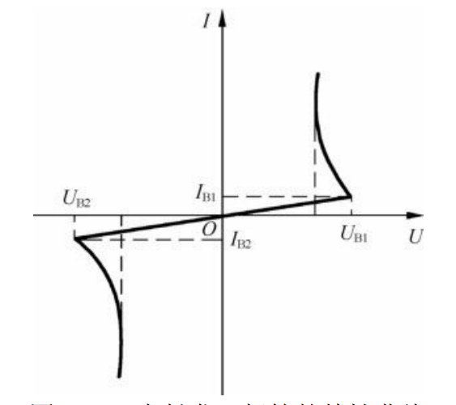

# 二极管
	二极管的位号为D

### 二极管分类
1. 常规二极管
2. 恒流二极管
   > 内部是由一个结型场效应管和一个电阻组成 ，作用是流过它的电流就会被限定在某一个值，适合驱动LED灯。
3. 肖特基二极管
   > 反向恢复电流时间极短，约在10ns，不耐压（上限100v），多用在高频低压场合
4. 快恢复二级管
   > 电路符号与普通二级管一致，耐压高（1000v以上）
5. 变容二极管
6. 电压抑制二极管（TVS）
   > 防止瞬态高压（比如静电）损坏电路，可以对电压进行限幅
7. 稳压二极管（齐纳二级管）
9. 发光二极管
10. 光电二极管

#### 稳压二极管
**主要参数**
1. 稳定电压：反向击穿状态时两端的电压值；
2. 最大稳定电流：稳压二极管正常工作时所允许通过的最大电流；
3. 最大耗散功率：稳压二极管通过反向电流时允许消耗的最大功率；

#### 变容二极管
	变容二极管可以视作电容使用，称为结电容，变容二极管工作在反接状态，相比普通二极管，其P型半导体和N型半导体的相对面积比较大。
	变容二极管的特性曲线为反向电压越大，结电容越小，这是因为反向电压越大，PN结越厚，内部的P、N型半导体距离越远。
##### 特性曲线

##### 主要参数
1. 结电容：施加一定反向电压后反向电容的大小；
2. 结电容变化范围：结电容随反向电压的变化范围；
3. 最高反向电压：

#### 双向触发二极管
	双向触发二极管的特性是无论正向电压还是反向电压都需要超过一定阈值才能使双向触发二极管导通。
	双向触发二极管有对称性，即正反接结果一样。
	双向触发二极管导通后，会有很大的电流通过，同时两端电压会下降
##### 特性曲线
