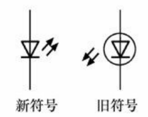

### 1-发光二极管
#### 1.1-发光二极管
发光二极管是一种电-光转换器件，能将电信号转换为光，需要正接且电压到一定阈值后才能导通，称为发光二极管的导通电压，其符号为$U_{vd}$。
发光二极管导通后有电流流过就开始发光，其电流越大，发出的光线越强。

位号为LED;

不同颜色的发光二极管，其导通电压有所不同，其典型值为：

|       颜色       | 导通电压  |
| :--------------: | :-------: |
|       红色       |  1.5v~2v  |
|       黄色       |    2v     |
|       绿色       | 2.5v~2.9v |
| 高亮度蓝光、白光 | 3v及以上  |

#### 1.2-双色发光二极管
	两种颜色的发光二极管接一起

#### 1.3-三色发光二极管
原理：
1. 直接相加混色法
2. 空间相加混色法：三个二极管紧密相邻
3. 时间相加混色法：快速切换+视觉暂留

#### 1.4-闪烁发光二极管

#### 1.5-红外线发光二极管
红外线发光二极管导通会发出人眼无法看见的红外光，一般用作发送家用电器的遥控信号，其图形符号与普通发光二极管的符号一致。

### 2-光电二极管
#### 2.1-光电二极管
光电二极管是一种光-电转换器件，能将光转换为电信号，特性光线越强，其自身电阻越小，在电路中一般是反接，其符号为：

主要参数：

|     参数     |                             含义                             |
| :----------: | :----------------------------------------------------------: |
| 最高工作电压 | 指无光线照射时，光电二极管反向电流不超过1uA时所加的最高反向电压值 |
|    光电流    | 光电二极管在受到一定光线照射并加有一定反向电压时的反向电流，该值越大越好 |
|    暗电流    | 光电二极管无光线照射并加有一定的反向电压时的反向电流，该值越小越好 |
|   响应时间   |             光电二极管将光转换成电信号所需的时间             |
|   光灵敏度   | 光电二极管对光线的灵敏度，指受到1uW光线照射时产生的电流大小，灵敏度单位是uA/W |

#### 2.2-红外线接收二极管
又称红外线光敏二极管，能将红外光转换为电信号，为了减少可见光的干扰，常采用黑色树脂材料封装，其电路符号与普通光电二极管一致。

### 3-光电三极管

### 4-光电耦合器
光电耦合器是将发光二极管和光电三极管组合在一起并封装起来构成的，其主要特点[百度百科]有
①光信号单向传输 ，输出信号对输入端无反馈，可有效阻断电路或系统之间的电联系，但并不切断他们之间的信号传递。
②隔离性能好，输入端与输出端之间完全实现了电隔离。
③光信号不受电磁波干扰，工作稳定可靠。
④光发射器件与光敏器件的光谱匹配十分理想，响应速度快，传输效率高，光电耦合器件的时间常数通常在微秒甚至毫微秒级。 
⑤抗共模干扰能力强，能很好地抑制干扰并消除噪音。 
⑥无触点，使用寿命长，体积小，耐冲击能力强。 
⑦易与逻辑电路连接。
⑧工作温度范围宽，符合工业和军用温度标准。

### 5-光遮断器
光遮断器又称光断续器，穿透型光电感应器，与光电耦合器一样由发光二极管和光电三极管组成，但光遮断器的发光二极管和光电三极管并没有封装成一体，而是相互独立。