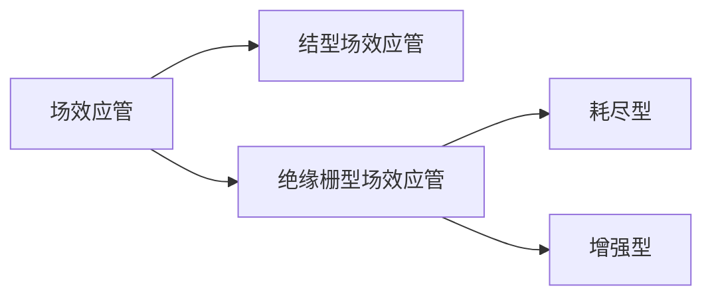

场效应管又称场效应晶体管（Filed Effect Transistor），缩写为FET，它与三极管一样具有放大能力。
场效应管有漏极（D极）、栅极（G极）、源极（S极）之分，同时场效应管可以分为结型和绝缘栅型。

#### 结型场效应管
根据制作工艺的不同，结型场效应管可以分为以下两种：
- P沟道场效应管，其电路符号为：
- N沟道场效应管，其电路符号为：

  其主要参数有：
|          主要参数          |                             描述                             |
| :------------------------: | :----------------------------------------------------------: |
|         跨导$g_m$          | 跨导$g_m$表示结型场效应管的放大能力，其定义为：$\large g_m = \frac{\Delta I_D}{\Delta U_{GS}}$,反映了G、S极电压$U_{GS}$对G极电流$I_D$的控制能力,单位是西门子（S） |
|       夹断电压$U_p$        | 指$U_{DS}$为一定值时，让电流$I_D$减小到近似为0A时的电压$U_{GS}$值。 |
| 饱和漏极(D极)电流$I_{DSS}$ |         指当$U_{GS}$=0V且$U_{DS}>U_p$时的漏极电流。          |
|     最大漏-源(D-S)电压     | 指漏极与源极之间的最大击穿电压，即当$I_D$急剧增大时的$U_{DS}$值。 |

结型场效应管在电路中的作用主要是放大信号电压。

其主要特点有：

1. D、S极之间的正反向电阻相等并且比较小，均为几十~几千$\Omega$。
2. 正反接效果一致。

#### 绝缘栅型场效应管

绝缘栅型场效应管（MOSFET），简称MOS管，MOS管分为耗尽型和增强型，每种类型又可以分为P沟道和N沟道。

##### 增强型MOS管

其电路符号为：

