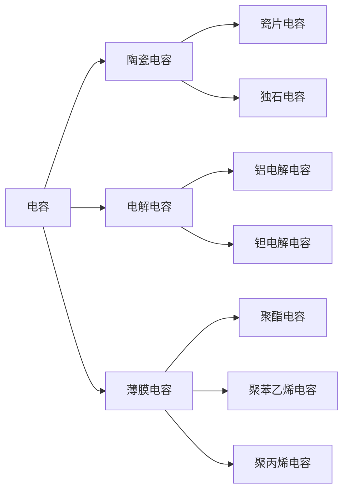
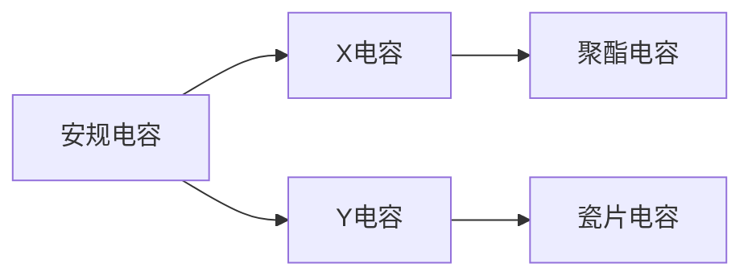

### 电容分类:

1. 瓷片电容

   > 由一层电极和一层介质构成

2. 独石电容（Multi Layer Ceramic Capacitors）

   > 由几层电极和介质构成，相比瓷片电容，容量要大，但是耐压不如瓷片电容，仅用于功率比较小的场景下。
   >
   > 容量一般在0.5pf~100uf之间，额定电压小于100v

3. 铝电解电容

   > 有贴片和插件两种形式，内部介质为铝电解液，区分正负极，一般用于电源滤波。
   >
   > 其容量一般在0.47pf\~10000uf，额定电压为6.3~450V

4. 钽电解电容

   > 内部电解质是钽的固体化合物，区分正负极，相比铝电解液，钽电解电容的填充物不会挥发，比如空调就可能因为内部铝电解电容的填充液干涸导致无法正常工作，但钽电解电容就不会出现这种情况。
   >
   > 此外，相同容量下，钽电解电容的体积比铝电解电容要小。
   >
   > 钽电解电容的缺点是耐压不行，一般耐压为10v的钽电容的施加电压不能超过6v，而且钽电容失效的后果可能是爆炸起火，同时，钽电压的价格也要高很多。
   >
   > 容量一般在0.1uf\~1000uf之间，额定电压为6.3~125V

5. 薄膜电容

|      |     聚酯电容（CL）     |     聚苯乙烯电容（CB）     |     聚丙烯电容（CBB）      |
| :--: | :--------------------: | :------------------------: | :------------------------: |
| 容量 |        40pf~4uf        |          10pf~1uf          |        1000pf~10uf         |
| 耐压 |        63v~630v        |          63v~20kv          |         63v~2000v          |
| 特点 | 体积小，容量大，耐湿热 | 稳定性好，耐压极高，体积大 |  稳定性差，耐压高，体积小  |
| 应用 |   要求不高的低频电路   | 稳定性和损耗要求较高的电路 | 稳定性和损耗要求较高的电路 |

### 主要参数
1. 容量及允许误差
2. 额定电压
3. 绝缘电阻：绝缘介质的绝缘程度

### 性质
1. 充放电
2. 隔直通交
3. 容抗
电容对交流电的阻碍作用称为容抗，用$X_C$表示，容抗的单位是欧姆$\Omega$， 容抗的大小与交流信号的频率、电容器的容量有关，其计算公式为：
$$X_C = \frac{1}{2\pi fC}$$
式中，$f$表示交流信号频率，$\pi$为常数3.14

### 电容的串联与并联

#### 串联
电容串联后总容量减小，其总容量的计算公式为
$$
	\frac{1}{C} = \frac{1}{C_1} + \frac{1}{C_2} = \frac{C_1 \cdot C_2}{C_1 + C_2}
$$
电容器串联后总耐压增大，总耐压较耐压最低的电容器的耐压高，同时，串联的各电容器两端承担的电压与容量成反比，即容量越大，在电路中承担的电压越低，关系式为：
$$
	\frac{C_1}{C_2} = \frac{U_2}{U_1}
$$
因此，电压器串联时，容量小的电容器应尽量选用耐压大的。

#### 并联
电容并联后的总容量增大，总容量等于所有并联电容器的容量之和，即$C = C_1 + C_2 + C_3$，其耐压以耐压最小的电容器的耐压为准。

## 安规电容

安规电容就是指通过安全规范测试认证、符合国家安全标准，失效后不会起火的电容，其主要作用就是对干扰信号进行滤波。
- X电容滤除差模干扰；
- Y电容滤波共模干扰；

## 电容的作用
1. 降压
2. 滤波
>	[滤波原理](https://www.bilibili.com/video/BV1ri4y1y7yG?vd_source=4989143aa5589a07b1d5b2115b0f3ba8)
1. 延时
2. 耦合
3. 旁路

引用来源：

[电容分类](https://www.bilibili.com/video/BV1yg41127vb?share_source=copy_pc)
[安规电容](【220V电路板为什么都要加X电容和Y电容？安规电容是怎么发挥作用的？】https://www.bilibili.com/video/BV1hB4y1j7PY?vd_source=4989143aa5589a07b1d5b2115b0f3ba8)
[电容的作用](https://www.bilibili.com/video/BV1UU4y1r72W?vd_source=4989143aa5589a07b1d5b2115b0f3ba8)
