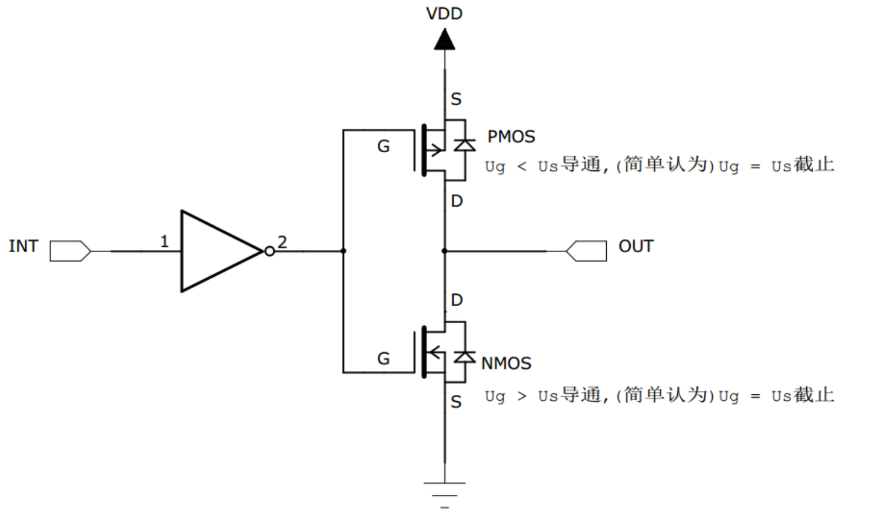
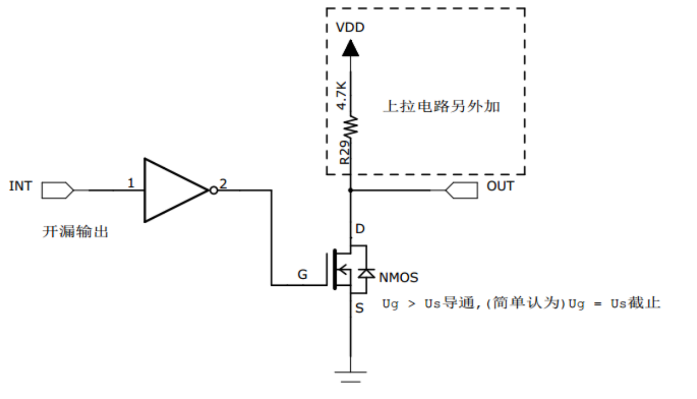

[什么是GPIO的推挽输出和开漏输出](https://www.bilibili.com/video/BV1zL411L7sj?vd_source=4989143aa5589a07b1d5b2115b0f3ba8)
[爱上半导体-上拉电阻的通俗解释](https://www.bilibili.com/video/BV1W34y1579U?vd_source=4989143aa5589a07b1d5b2115b0f3ba8)

上拉电阻：将不确定的信号钳位在高电平；
下拉电阻：将不确定的信号钳位在低电平；

#### 推挽输出：

	输出高电平：当INT输出的高电平经反向后，上方的P-MOS导通，下面的N-MOS截止，输出口对外输出高电平；
	输出低电平：当INT输出的低电平经反向后，上方的P-MOS截止，下面的P-MOS导通，输出口对外输出低电平；
	推挽输出模式一般应用在输出电平为0v和3.3v而且需要高速切换开关状态的场合。
优点：
- 输出高低电平与电源电压基本没有压差；
- 高低电平驱动能力较强，一般数字芯片推挽输出IO口驱动电流最大可到20mA；
- 电平切换速度快；
缺点：
- 不支持线与，导通电阻小，可能烧坏芯片；

#### 开漏输出：

	在开漏输出模式时，上方的P-MOS管将完全不工作；
	输出高电平：INT输出高电平，经反向后，下方的N-MOS管截止，由上拉电阻提供高电平；
	输出低电平：INT输出低电平，经反向后，下方的N-MOS管导通，将输出低电平；
	开漏输出一般应用在I2C、SMBUS通讯等需要“线与”功能的总线电路中，除此之外还用在电平不匹配的场合，如需要输出5V的高电平就可以在外部接一个上拉电阻，上拉电源为5v，并且把GPIO设置为开漏模式，当输出高阻态时，由上拉电阻和电源向外输出5v的电平。
优点：
- 可以实现电平转换，输出电平取决于上拉电阻电源；
- 可以实现IO的线与；
缺点：
- 高电平驱动能力差，取决于外部上拉电阻；
- 电平切换速度取决于外部上拉电阻，电阻越小速度越快； 

线与：
	若有很多个开漏模式引脚连接在一起时，只有当所有引脚都输出高阻态时才由上拉电阻提供高电平，此时高电平的电压为外部上拉电阻所接的电源的电压，若其中一个引脚为低电平，那线路就相当于短路接地，使得整条线路都为低电平0v；