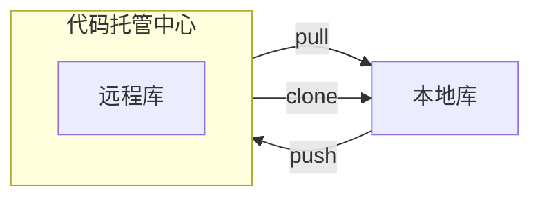
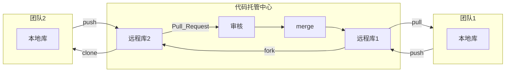
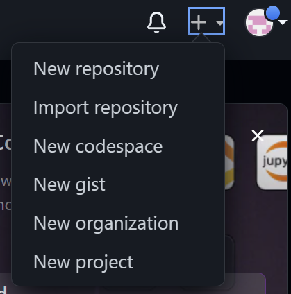
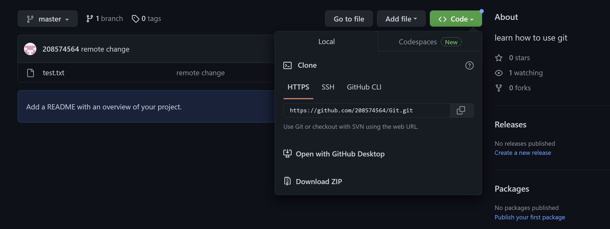

### 介绍
	Git是一个免费的、开源的分布式版本控制系统，可以快速高效地处理从小型到大型的各种项目。
	Git易于学习，占地面积小，性能极快。具有廉价的本地库，方便的暂存区和多个工作流分支等特性，其性能优于Subversion、CVS、Perforce和ClearCase等版本控制工具。

#### 集中式版本控制工具：
	例如CVS、Subversion(SVN)、VSS；
	集中式版本控制工具都有一个单一的集中管理的服务器，保存所有文件的修订版本，而协调工作的人可以通过客户端连接到这台服务器，取出最新的文件或者提交更新。
	同时管理员可以管理每个开发者的访问权限；
	缺点是当中央服务器出现故障的时候，将无法正常工作。

#### 分布式版本控制工具：
	例如Git、Mercurial、Bazaar、Darcs、Gitee；
	分布式版本工具，客户端提取的不是最新版本的文件快照，而是把代码完整地镜像下来（本地库），这样任何一处协同工作用的文件发生故障，事后都可以用其他客户端的本地仓库进行恢复，因为每个客户端的每一次文件提取操作，实际上都是一次对整个文件仓库的完整备份。
	分布式版本控制解决了集中式版本控制的缺陷：
	1.服务器断网的情况下也可以进行开发（因为版本控制是在本地进行的）；
	2.每个客户端保存的也都是整个完整的项目（包含历史记录，更加安全）；

#### 相关概念：
- 分支：在项目开发周期内任意时间点上fork出去的项目。
- 冲突：合并分支时，两个分支在同一个文件的同一个位置有两套完全不同的修改，git会交由人工决定冲突的内容属于哪一个分支。人工合并冲突内容后需要先`git add 文件名`,然后`git commit`，注意commit时不能添加文件名。

#### Git工作机制：

- 工作区：代码存放的磁盘位置；
- 暂存区：不会生成历史版本；
- 本地库：产生历史版本；

代码托管中心：基于网络服务器的远程代码仓库，简称远程库；
- 局域网：GitLab
- 互联网：GitHun、Gitee

Git Bash 控制命令：
- Ctrl+鼠标滚轮：调整字体大小；

### Git 使用

#### 用户签名
- `git config --global user.name 用户名`;
- `git config --global user.email 邮箱`;
签名的作用是区分不同操作者的身份，用户的签名信息在每一个版本的提交信息中能够看到，以此确认本次提交是谁做得，Git首次安装必须设置一下用户签名，否则无法提交代码。
// 此外，这里设置到的用户签名与登录Github（或其他代码托管中心）的账号没有任何关系；//

#### 初始化本地库
- `git init`：初始化本地库，出现配置文件；

#### 查看本地库状态
- `git status`:查看本地库状态；

#### 暂存区操作
- `git add 文件名.后缀名`:将文件添加到暂存区；
- `git rm --cached 文件名.后缀名`:将文件从暂存区中删除；

#### 本地库操作
- `git commit -m "日志信息" 文件名.后缀名`:将文件从暂存区提交到本地库

#### 版本穿梭
- `git reset --hard 版本号` ：穿梭到指定版本，工作区下的所有文件也会回到指定版本时期；

#### Git分支操作
	在版本控制过程中，同时推进多个任务，我们就可以创建每个任务的单独分支。使用分支意味着程序员可以把自己的工作从开发主线上分离开来，开发自己分支的时候，不会影响到主线分支的运行。
	这种特性的好处在于同时推进多个功能的开发，各个版本的开发，比如稳定版，测试版，开发版。
	新的分支将拥有未修改前的版本；
- `git branch 分支名`：创建分支；
- `git branch -v`：查看分支；
- `git checkout 分支名`:切换分支；
- `git merge 分支名`：把指定的分支合并到当前分支上；

##### 合并冲突
在合并两个分支的时候容易因为内容冲突而无法合并成功，而在修改内容后还需要将修改好的文件重新添加到暂存区，再由暂存区添加到本地库后(合并期间使用`git  commit`命令无需指定文件名)进行新一次的合并。

### Git团队协作
团队内协作：

- clone：完整地把所有代码从远程库中复制下来；
- push：在已有本地库的基础上将远程库的更新部分拉取下来；
- pull：提交代码的前提是在管理员将自己添加到团队中；

跨团队协作：

#### Github操作
- 创建远程仓库

- Github仓库链接(或称为远程地址)

1. 创建远程库别名：
- `git remote -v`:查看当前所有远程地址别名；
- `git remote add 别名 远程地址`：创建远程库别名；
- `git remote rm 别名`:删除远程库别名；

2. 推送本地库到远程库：
- `git push 别名 分支名`：将当前分支推送到远程库；

3. 拉取远程库到本地库：
- `git pull 别名 分支`：拉取远程库到本地分支；本地库也会自动更新

4. 克隆远程库到本地库：
- `git clone 远程地址`：克隆远程库到本地库，这个过程是不需要设置用户签名及本地库初始化的。
	clone会做如下操作：
		1.拉取代码；
		2.初始化本地仓库；
		3.创建别名；

 
### Git常用命令：

- `git --version`									   ：查看版本信息
- `git config --global user.name 用户名`                 ：设置用户签名
- `git config --global user.email 邮箱`                   ：设置用户签名
- `git init`                                          ：初始化本地库(要在本地库文件夹目录下使用该命令)
- `git status`                                        ：提示当前工作区文件信息，提交、未提交等；
- `git reflog`                                        ：查看版本信息，每个版本信息前面的数字字符串是该版本的版本号。
- `git log`                                          : 查看日志信息
- `git  add 文件名`                                    ：添加文件到暂存区
- `git rm --cached 文件名 `                             ：从暂存区中删除文件
- `git commit -m "备注" 文件名`                         ：添加到本地仓库
- `git reset --hard 版本号(7位数)`                        ：版本穿梭，本地库中的内容也会变为指定版本
- `git branch -v`                                      ：版本分支信息
- `git branch 分支名`                                  ：创建分支
- `git checkoout 分支名`                               ：选择分支，同时修改本地仓库的内容
- `git merge 分支名`                                  ：将指定分支合并到当前分支
- `git remote -v `                                     ：查看远程库别名
- `git remote add 远程库别名 远程库地址`                 ：为远程库添加别名
- `git clone 远程库地址`                                ：克隆

其他：
decsidecar：无法访问github的解决工具；
多人协作时需要：（详见P24）
1. 先登录Github在settings的Collaborators选项中添加新的开发人员，添加的方式是直接搜索其账号。
2. 添加成功后在Manage access一栏中会出现待邀请人员的名单，点击Pending Invite旁边的剪切板复制邀请链接发送给受邀人员。
3. 受邀人员点开邀请链接，接受邀请，则可在git bash中push代码。  

参考资料：
1. [尚硅谷Git入门到精通全套教程（涵盖GitHub\Gitee码云\GitLab](https://www.bilibili.com/video/BV1vy4y1s7k6?p=11&vd_source=4989143aa5589a07b1d5b2115b0f3ba8)
2. 