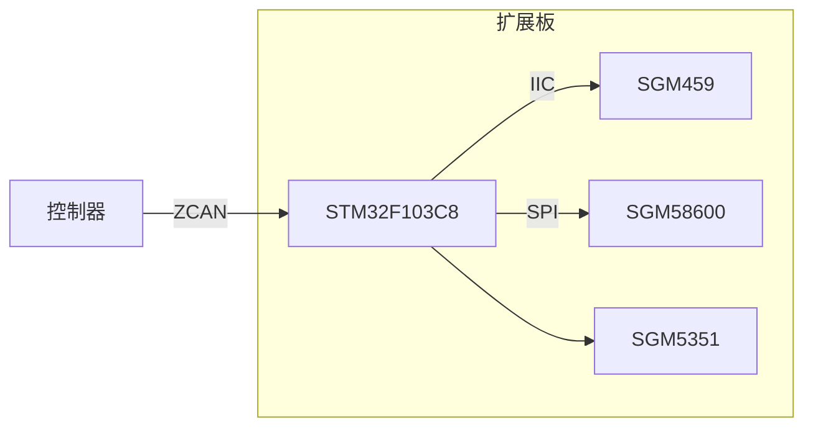

先行知识：
- 热电偶：[热电偶_百度百科 (baidu.com)](https://baike.baidu.com/item/%E7%83%AD%E7%94%B5%E5%81%B6/5028266)
- 冷端补偿：
- 分度表：
- PID；

相关芯片：
- 温度传感器SGM459：
	- 三位地址寻址，最多同时支持八个SGM459；
	- 温度测量范围-55°C~+125°C，精度为正负1.2°C，12位精度；
	- IIC协议；
- 24bit ADC SGM58600：
	- 24bit ADC，无噪声分辨率高达22位；
	- 数据输出速率高达60kSPS，并支持增益设置，自校准和系统校准；
	- SPI协议；
- 16Bit DAC SGM5351：

框架图：

启动过程：
1. 上电初始化，通过CAN总线与控制器建立连接，初始化目标温度为上一次的目标值；
2. 获取热端温度，并进行上报：
	1. 获取冷端温度，换算成对应毫伏；
	2. ADC获取热电偶输出的电势差；
	3. 通过热电偶分度表查找冷端温度对应0°C下的热电偶输出电势差；
	4. 电势差相加得到热端温度对应0°C下的热电偶输出的电势差；
	5. 使用“插值查找法”通过热电偶的分度表快速反向查找到热端真实温度并实时上报，方便上位机观察设备温度变化曲线，同时方便操作人员调节PID参数；
3. 控制系统获取热端温度后形成闭环，使用增量式/位置式PID控制DAC输出（防止积分饱和）；
4. 扩展板时刻等待用户设置的PID参数、热电偶类型、目标温度等参数并实时更新设置；